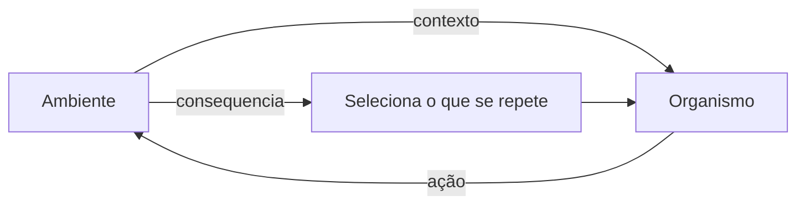

---
layout: agenda
kicker: Aula 01
title: O caminho de hoje
items:
  - { topic: O problema, desc: "por que 'mente' não resolve" }
  - { topic: Comportamento, desc: "a definição que muda tudo" }
  - { topic: Três behaviorismos, desc: "Watson, Skinner e o que os separa" }
  - { topic: A unidade de análise, desc: "relação, não resposta" }
---

---
layout: statement
kicker: Ponto de partida
title: "«Ele bateu no colega porque é agressivo.» E como sabemos que ele é agressivo? Porque bate."
---

<!-- Deixe a turma sentir o círculo antes de nomeá-lo. Pergunte: o que essa frase explica? Ela nomeia, não explica. É aqui que o curso inteiro começa. -->

---
layout: define
kicker: O erro que organiza a aula
term: Explicação circular
definition: Quando a causa do comportamento é inferida do próprio comportamento que ela deveria explicar.
points:
  - "Chora muito → é ansioso → por isso chora"
  - "Não estuda → é desmotivado → por isso não estuda"
  - "O nome vira diagnóstico, e o diagnóstico vira destino"
---

---
layout: bigtype
kicker: A virada
title: Pare de perguntar <em>o que ele é</em>. Pergunte <em>o que aconteceu</em>.
---

---
layout: define
kicker: A definição
term: Comportamento
definition: Qualquer interação entre o organismo e o ambiente — não algo que o corpo faz sozinho.
points:
  - "Não é só o movimento: é o movimento no contexto"
  - "Pensar e sentir também são comportamento — privados, mas comportamento"
  - "Uma mesma ação pode ser comportamentos diferentes"
---

<!-- Exemplo para fixar: levantar a mão na sala e levantar a mão para espantar mosquito. Topografia igual, comportamento diferente — porque a relação com o ambiente é outra. -->

---
layout: diagram
kicker: A unidade de análise
title: O que estudamos é a <em>relação</em>
note: O organismo age sobre o ambiente; o ambiente <strong>seleciona</strong> quais ações se mantêm. A seta de volta é o objeto de estudo.
build: true
---

---
layout: timeline
kicker: Como chegamos aqui
title: Um século em quatro marcos
events:
  - { date: "1913", title: "Manifesto de Watson", desc: "psicologia como ciência natural do comportamento" }
  - { date: "1938", title: "The Behavior of Organisms", desc: "Skinner descreve o operante" }
  - { date: "1953", title: "Ciência e Comportamento Humano", desc: "a análise vai para a cultura e a clínica" }
  - { date: "1974", title: "Sobre o Behaviorismo", desc: "o mundo sob a pele também é comportamento" }
---

---
layout: vs
kicker: A confusão mais comum
title: Dois behaviorismos que não são o mesmo
label: ×
left:
  title: Metodológico (Watson)
  items:
    - "Só o público é científico"
    - "Pensamento e sentimento ficam de fora"
    - "A caixa-preta permanece fechada"
right:
  title: Radical (Skinner)
  items:
    - "Eventos privados também são comportamento"
    - "Pensar e sentir entram na análise"
    - "O que se rejeita é a causa mentalista, não o mundo interno"
---

<!-- O adjetivo 'radical' aqui é no sentido de raiz, de completo — não de extremo. Vale dizer isso em voz alta: quase toda turma chega com essa palavra errada. -->

---
layout: panels
kicker: Três níveis de seleção
title: O comportamento é selecionado em três escalas
panels:
  - { icon: "lucide:dna", title: Filogênese, items: ["Seleção natural da espécie", "Reflexos, prontidões inatas"] }
  - { icon: "lucide:user", title: Ontogênese, items: ["História de vida do indivíduo", "Aprendizagem por consequências"] }
  - { icon: "lucide:users", title: Cultura, items: ["Práticas transmitidas pelo grupo", "O que o ambiente social mantém"] }
---

---
layout: two-cols
kicker: Na prática
title: Trocando a pergunta na entrevista clínica
---

Em vez de mirar o rótulo, mire a **contingência**:

- Em que situações acontece?
- Com que frequência, por quanto tempo?
- O que vem logo depois?
- O que muda quando não acontece?

<Callout tone="warn" icon="lucide:triangle-alert">
Rótulo não é dado. <strong>"É agressivo"</strong> não diz onde, quando, nem para quê.
</Callout>

::right::

<Callout icon="lucide:search">
<strong>"Bate no colega quando perde no jogo, e o professor o tira da sala"</strong> — agora existe algo a analisar.
</Callout>

Descrição assim já sugere hipótese, medida e intervenção.

<Tags :items="['Quando', 'Onde', 'Com quem', 'O que vem depois', 'Com que frequência']" />

<!-- Se sobrar tempo, peça que dupla reescreva uma queixa comum ('é preguiçoso') como descrição de contingência. Rende cinco minutos ótimos. -->

---
layout: quote
quote: O comportamento é uma coisa difícil de estudar — não porque seja inacessível, mas porque é fluido, mutável, e nunca está parado.
author: B. F. Skinner, 1953
---

---
layout: statement
kicker: A síntese
title: Comportamento não é o que o organismo <em>tem</em>. É o que o organismo <em>faz</em> — e onde faz.
---

---
layout: end
title: Até a próxima
subtitle: "Aula 02 — como o ambiente ensina: condicionamento respondente e operante"
contact: Leitura · Skinner (1953), cap. 1–3
---
