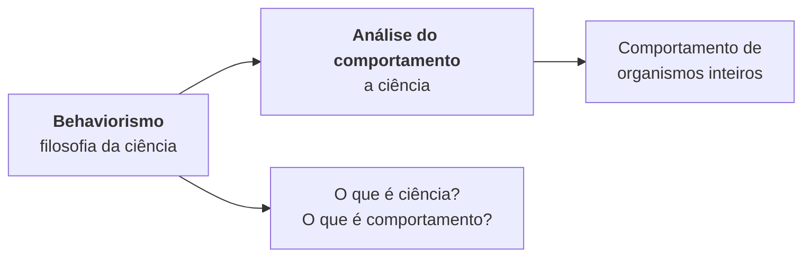

---
layout: agenda
kicker: Três horas, quatro partes
title: O caminho de hoje
items:
  - { topic: Da filosofia à ciência, desc: "como as ciências abandonaram os agentes ocultos" }
  - { topic: Livre-arbítrio e determinismo, desc: "a controvérsia que o behaviorismo herdou" }
  - { topic: Realismo e pragmatismo, desc: "duas respostas para «o que é ciência?»" }
  - { topic: "Público, privado e fictício", desc: "por que o mentalismo não explica" }
---

<!-- Diga de saída que a aula de hoje é filosófica, não técnica: ninguém vai ver reforço, esquema ou contingência. Isso baixa a ansiedade de quem espera "a matéria" e prepara para o fato de que a Parte I do livro é sobre o que autoriza o resto. -->

---
layout: define
kicker: O ponto de partida
term: A proposição central do behaviorismo
definition: Uma ciência do comportamento é possível.
points:
  - "Behavioristas divergem sobre o que é ciência e o que é comportamento"
  - "Todos concordam que pode haver uma ciência do comportamento"
  - "Tudo o que é realmente controverso decorre dessa única ideia"
---

<!-- Baum abre o capítulo 1 exatamente assim. Vale escrever a frase no quadro e deixá-la lá a aula inteira: as quatro partes de hoje são consequências dela. -->

---
layout: diagram
kicker: Uma distinção que a turma costuma errar
title: Behaviorismo não é a ciência — é a filosofia dela
note: O behaviorismo é um conjunto de ideias <strong>sobre</strong> essa
  ciência. Por isso ele não é ciência, mas <strong>filosofia da
  ciência</strong>.
---

<!--
A maioria dos behavioristas passou a chamar a ciência do comportamento de análise do comportamento. O debate sobre se ela é parte da psicologia, se é a psicologia ou se é independente continua — mas associações como a ABA e revistas como o JEAB deram identidade ao campo.
-->

---
layout: section
index: "01"
kicker: Parte um
title: Da filosofia à ciência
subtitle: O padrão que se repetiu na astronomia, na química, na fisiologia e na biologia
---

---
layout: default
kicker: Contexto histórico
title: Toda ciência começou dentro da filosofia
---

Antes de existirem como ciências, astronomia e física eram especulação a partir de pressupostos sobre Deus ou sobre alguma ordem ideal:

<v-clicks>

- A Terra deveria ser o centro, pois os eventos importantes ocorrem nela
- O círculo é a forma perfeita, logo o Sol viaja em órbita circular
- As estrelas estão numa esfera, a forma tridimensional mais perfeita

</v-clicks>

<Callout icon="lucide:sparkle">
Até hoje chamamos o Sol, a lua e as estrelas de <strong>corpos celestes</strong> — porque se supunha que fossem perfeitos.
</Callout>

<!-- Esse é um bom momento para mostrar que a linguagem guarda fósseis de teorias abandonadas. Volta a ser útil no capítulo 3, quando "mente" aparecer como fóssil do mesmo tipo. -->

---
layout: steps
kicker: A ruptura
title: O movimento que fundou cada ciência
steps:
  - { title: Especulação, desc: "parte-se de pressupostos e se conclui como o mundo deveria ser", icon: "lucide:cloud" }
  - { title: Observação, desc: "Galileu aponta o telescópio e vê crateras, não uma esfera perfeita", icon: "lucide:telescope" }
  - { title: Descrição, desc: "Galileu e Newton inventam velocidade, aceleração, força, inércia", icon: "lucide:ruler" }
  - { title: Explicação natural, desc: "eventos naturais explicados por outros eventos naturais", icon: "lucide:git-branch" }
---

<!-- Galileu (1564-1642) e Newton (1642-1727). O ponto não é a cronologia, é a direção do movimento: da dedução a partir de pressupostos para a inferência a partir de observações. -->

---
layout: vs
kicker: Duas direções de raciocínio
title: Por que a ruptura era necessária
label: ×
left:
  title: A filosofia
  items:
    - "«Se isto fosse assim, então aquilo seria assim»"
    - "Parte de pressupostos, chega a conclusões"
    - "A verdade é absoluta"
    - "Pressupostos sobre abstrações: Deus, harmonia, formas ideais"
right:
  title: A ciência
  items:
    - "«Isto é observado; o que levaria a tal observação?»"
    - "Parte da observação, chega a teorias"
    - "A verdade é relativa e provisória"
    - "Pressupostos apenas sobre o universo natural"
---

<!-- Baum é explícito: a verdade científica é relativa à observação e passível de ser desmentida por novas observações. Por muito tempo se pensou haver sete planetas; um oitavo e um nono foram descobertos. -->

---
layout: default
kicker: O padrão
title: Cada ciência teve de expulsar seu <em>agente oculto</em>
---

<Tabela
  :dados="[
    ['Ciência', 'O agente oculto', 'O que o substituiu'],
    ['Astronomia e física', 'esferas e órbitas perfeitas', 'observação, medida, inércia'],
    ['Química', 'calórica, flogisto, essências', 'oxigênio (Lavoisier), pesagem cuidadosa'],
    ['Fisiologia', 'vis viva, força vital, alma', 'o coração como bomba (Harvey)'],
    ['Biologia', 'a criação por Deus', 'seleção natural (Darwin)'],
    ['Psicologia', 'o livre-arbítrio, o eu interior', 'hereditariedade e ambiente'],
  ]"
  cabecalho
  realce="linha:6"
/>

<!-- Essa é a tabela-espinha da aula. O argumento do Baum é de simetria: se aceitamos que a química expulsou o flogisto, por que a psicologia não expulsaria o livre-arbítrio? A última linha é o que vamos discutir na Parte 2. -->

---
layout: quote
quote: "Hypotheses non fingo — «Eu não invento hipóteses»."
author: Isaac Newton, sobre não recorrer a entidades sobrenaturais ao estudar física
---

<!-- A razão pela qual o oceano tem marés não é a vontade de Deus, mas a atração gravitacional da lua. Guarde essa frase: ela reaparece no capítulo 3, quando Baum a usa contra as causas mentais. -->

---
layout: metric
kicker: A psicologia rompeu tarde
value: "1940"
unit: ""
label: até essa década, poucas universidades tinham um <em>departamento</em> separado de psicologia — professores de psicologia eram encontrados no departamento de filosofia.
ghost: "?"
---

<!-- Isso explica por que a discussão ainda está viva. A biologia evolutiva, com raízes em meados do século XIX, ainda está completando sua ruptura; não é surpresa que psicólogos ainda discutam se a psicologia é uma ciência de verdade. -->

---
layout: default
kicker: A segunda metade do século XIX
title: A psicologia como <em>ciência da mente</em>
---

- *Psique* significava algo próximo de "espírito" — **mente** parecia menos especulativo
- Como estudar a mente? Adotando o método dos filósofos: a **introspecção**
- Se a mente é um palco, deveria ser possível olhar dentro e ver o que ocorre
- Parecia aos psicólogos que a dificuldade se venceria com treino e prática

<Callout tom="alerta" icon="lucide:triangle-alert">
Duas correntes se somaram para corroer essa visão: a <strong>psicologia objetiva</strong> e a <strong>psicologia comparativa</strong>.
</Callout>

<!-- Note que a introspecção não era ingenuidade: era a importação de um método filosófico consagrado para dentro de um projeto que se queria científico. O problema não era falta de rigor, era o tipo de dado. -->

---
layout: panels
kicker: As duas correntes
title: O que corroeu a introspecção
panels:
  - icon: "lucide:ruler"
    title: Psicologia objetiva
    items:
      - "A introspecção é pouco confiável e muito subjetiva"
      - "Outras ciências produzem medidas replicáveis"
      - "Se dois introspectores discordam, nada resolve o conflito"
  - icon: "lucide:dna"
    title: Psicologia comparativa
    items:
      - "Humanos não são separados dos outros seres vivos"
      - "Continuidade das espécies: compartilhamos traços comportamentais"
      - "Estudar outras espécies ensina sobre a nossa"
---

<!-- As duas nascem de motivos opostos e convergem no mesmo lugar: nenhuma das duas precisa da consciência para funcionar. -->

---
layout: timeline
kicker: Psicologia objetiva
title: Medidas objetivas de processos mentais
events:
  - { date: "1860s", title: "Fechner", desc: "diferença apenas perceptível: a menor diferença física detectável" }
  - { date: "1868", title: "Donders", desc: "tempo de reação — subtrair o simples do de escolha mede o processo mental" }
  - { date: "1885", title: "Ebbinghaus", desc: "sílabas sem sentido para medir aprendizado e memória" }
  - { date: "1900s", title: "Pavlov", desc: "reflexo transferido a novos sinais, organizados em laboratório" }
---

<!-- Donders é o exemplo mais bonito: o problema veio da astronomia — astrônomos diferentes cronometravam o mesmo trânsito de estrela de formas diferentes, e criou-se a "equação pessoal" para corrigir cada um. Donders transformou o erro em objeto de medida. -->

---
layout: default
kicker: Psicologia comparativa
title: A humanização da fera
---

Depois de *The expression of the emotions in men and animals*, as evidências de mentalidade animal eram **anedotas**:

- O cão que abriu o portão levantando o trinco, depois de ver o dono
- Romanes supondo uma tênue consciência em formigas
- Nos labirintos, ratos com **tédio, confusão, hesitação e confiança**

<Callout tom="ruim" icon="lucide:circle-x">
Se dois observadores discordam sobre a própria raiva, discordarão mais ainda sobre a raiva de um rato — e mais observações não resolvem, porque o problema é o <strong>tipo de dado</strong>.
</Callout>

<!-- Antropomorfismo é o termo-chave desta página. Watson conclui que inferências sobre consciência animal são ainda menos confiáveis que a introspecção, e que nenhuma das duas serve de método. -->

---
layout: quote
quote: "Se você não conseguir reproduzir minhas descobertas… é porque sua introspecção não foi bem treinada. Ataca-se o observador, e não a situação experimental. Na física e na química, atacam-se as condições experimentais."
author: J. B. Watson, 1913, p. 163
---

<!-- Esse é o argumento decisivo, e é metodológico, não metafísico: numa ciência madura, o fracasso acusa o procedimento; na introspecção, o fracasso acusa a pessoa. Uma disciplina assim não acumula conhecimento. -->

---
layout: define
kicker: 1913 · o manifesto
term: A primeira versão do behaviorismo
definition: A psicologia deve ser definida como a ciência do comportamento, não da consciência.
points:
  - "Jamais usar: consciência, estados mentais, mente, conteúdo, imagens"
  - "Evitar a subjetividade da introspecção e das analogias com animais"
  - "Estudar apenas o comportamento objetivamente observável"
  - "Uma ciência geral do comportamento, com humanos como apenas uma espécie"
---

<!-- Watson leu Pillsbury definir psicologia como ciência do comportamento e, poucas páginas depois, voltar ao "tratamento convencional" da consciência. Daí a frase: podemos escrever uma psicologia, defini-la como Pillsbury e nunca renunciar a essa definição. -->

---
layout: default
kicker: Já em 1913
title: Os termos ficaram em aberto
---

Mesmo na época de Watson, os behavioristas já debatiam a receita. Não estava claro:

- o que significava **objetivo**
- o que exatamente constituía **comportamento**

<Callout icon="lucide:git-fork">
Como esses dois termos ficaram abertos à interpretação, as ideias dos behavioristas sobre o que é ciência e como definir comportamento <strong>variaram</strong> — e é dessa variação que nascem as escolas que veremos hoje.
</Callout>

<!-- Prepare aqui a entrada do Skinner: enquanto os outros se concentraram em métodos das ciências naturais (medição, controle experimental), Skinner focou nas explicações científicas. Ele rotulou a visão oposta de behaviorismo metodológico e chamou a sua de radical. -->

---
layout: section
index: "02"
kicker: Parte dois
title: Livre-arbítrio versus determinismo
subtitle: A controvérsia genuína que a negação de agentes ocultos produz
---

---
layout: define
kicker: A implicação imediata
term: Determinismo
definition: A noção de que o comportamento é determinado unicamente pela hereditariedade e pelo ambiente.
points:
  - "O comportamento é ordenado"
  - "Pode ser explicado"
  - "Pode ser previsto, desde que se tenham os dados necessários"
  - "Pode ser controlado, desde que se tenham os meios corretos"
---

<!-- Repare que determinismo aqui não é uma tese metafísica sobre o universo: é o que está implicado em dizer que uma ciência do comportamento é possível. Se o comportamento não fosse ordenado, não haveria o que estudar. -->

---
layout: define
kicker: O que exatamente se nega
term: Livre-arbítrio libertário
definition: A ideia de que a escolha pode realmente ser livre de eventos passados.
points:
  - "Um terceiro elemento, além da hereditariedade e do ambiente"
  - "Algo dentro do indivíduo, que poderia ter escolhido de outra forma"
  - "Afirma que a escolha não é ilusão: o próprio indivíduo causa o comportamento"
---

<Callout tom="alerta" icon="lucide:triangle-alert">
Só esta versão conflita com o behaviorismo. Definições compatibilistas — como as de Hebb e Dennett — não apresentam problema para uma ciência do comportamento.
</Callout>

<!-- Vale gastar um minuto aqui. O determinismo brando (Hebb) diz que o livre-arbítrio é o fato de o comportamento depender da história passada, menos visível que o ambiente presente. Dennett define livre-arbítrio como deliberação antes da ação — e deliberar é comportamento, que também é determinado. -->

---
layout: default
kicker: Por que o debate não se resolve
title: Nenhuma evidência decide a questão
---

Para comprovar o livre-arbítrio seria preciso que um ato **contrariasse a previsão**, mesmo com todos os fatores contribuintes conhecidos. Como esse conhecimento perfeito é impossível na prática, o conflito nunca será resolvido por demonstração.

<Circular
  observacao="Jovem de bom lar torna-se dependente de drogas"
  ficcao="Escolheu isso livremente"
  inferencia="nada na história explica, logo…"
  explicacao="…e por isso agiu assim"
  nota="O determinista responderá que investigação adicional revelará os fatores genéticos e ambientais."
/>

<!-- O outro exemplo do livro é Mozart: se a carreira parece previsível pela história familiar e pela Viena da época, o defensor do livre-arbítrio dirá que o pequeno Wolfgang escolheu livremente agradar os pais. A discussão não se fecha por evidência — ela se desloca para as consequências de adotar um lado. -->

---
layout: columns
kicker: Se a evidência não decide
title: Restam dois tipos de argumento
columns:
  - title: "Sociais"
    items:
      - "O que acontece com o sistema judicial?"
      - "E com as eleições, se a escolha não é livre?"
      - "Determinismo encorajaria uma ditadura"
      - "Sem livre-arbítrio, a moral desaba"
  - title: "Estéticos"
    items:
      - "O livre-arbítrio é ilógico junto de um Deus onipotente"
      - "A imprevisibilidade seria prova de liberdade"
      - "Como um evento não natural causa um natural?"
      - "A ciência exclui mistérios que não podem ser explicados"
---

<!-- Baum trata os sociais primeiro e volta a eles na Parte III do livro. Aqui basta o apanhado. -->

---
layout: default
kicker: Argumentos sociais
title: A ameaça à democracia parte de um falso pressuposto
---

<v-clicks>

- É verdade que a democracia depende da **escolha**
- É falso que a escolha perca sentido sem livre-arbítrio
- O voto depende do histórico da pessoa **e** dos eventos que antecedem a eleição
- É exatamente por isso que se fazem campanhas

</v-clicks>

<Callout icon="lucide:vote">
As pessoas não precisam ter livre-arbítrio para que as eleições tenham sentido; seu comportamento só precisa estar <strong>aberto à influência e à persuasão</strong>.
</Callout>

<!-- Somos favoráveis à democracia não porque temos livre-arbítrio, mas porque, como conjunto de práticas, ela funciona. Baum cita o World Happiness Report de 2015: os cinco países mais felizes — Suíça, Islândia, Dinamarca, Noruega e Canadá — são todos democracias. -->

---
layout: default
kicker: Argumentos sociais
title: Moral e justiça sem livre-arbítrio
---

**Padrões morais.** Budistas e hinduístas, na China, no Japão e na Índia, não têm o compromisso ocidental com a noção de livre-arbítrio. Comportam-se de maneira menos moral?

**Sistema judiciário.** Continuaremos a "responsabilizar pessoas por seu comportamento" no sentido prático de atribuir ações a indivíduos.

<Callout tom="bom" icon="lucide:scale">
Estabelecido que alguém transgrediu, as perguntas passam a ser <strong>práticas</strong>: como proteger a sociedade e como tornar improvável a repetição. Encarcerar tem feito pouco para evitar reincidências.
</Callout>

<!-- Longe de destruir a moral, diz Baum, a ciência do comportamento pode ser usada para educar crianças para que se tornem cidadãos bons, felizes e eficientes. -->

---
layout: statement
kicker: Argumentos estéticos
title: O livre-arbítrio é um nome para a ignorância dos determinantes do comportamento.
---

<!-- Essa é a formulação do próprio Baum e é o coração do capítulo 1. Deixe o slide respirar. -->

---
layout: default
kicker: A evidência disso
title: Quanto mais sabemos, menos recorremos ao livre-arbítrio
---

<v-clicks>

- Menino que rouba carros vindo de **ambiente pobre** → atribuímos ao ambiente
- Sabendo que foi **maltratado e negligenciado** → menos ainda dizemos que escolheu
- Político que **aceitou suborno** → não consideramos suas posições livremente assumidas
- Artista com **pais compreensivos e um grande professor** → menos curiosidade sobre o talento

</v-clicks>

<Callout icon="lucide:search">
A explicação pelo livre-arbítrio recua exatamente na medida em que a história de vida avança.
</Callout>

<!-- Aqui costuma aparecer a objeção "mas então ninguém é responsável por nada". Segure para a Parte III; hoje o ponto é epistemológico, não moral. -->

---
layout: default
kicker: Argumentos estéticos
title: Imprevisibilidade não é prova de liberdade
---

O argumento contém um erro lógico: o livre-arbítrio implica imprevisibilidade, mas isso **não exige o inverso**.

- O clima é imprevisível, e nunca o consideramos produto do livre-arbítrio
- Muitos sistemas naturais são imprevisíveis momento a momento, e não são livres
- Por que exigir um padrão mais elevado da ciência do comportamento?

<Callout tom="alerta" icon="lucide:brain">
E há um problema adicional: se meu livre-arbítrio causa meu comportamento, eu deveria <strong>prever perfeitamente</strong> o que vou fazer — afinal, conheço minha própria vontade.
</Callout>

<!-- O argumento é elegante e a turma costuma gostar: se decido fazer dieta e sei que essa é minha vontade, deveria prever que farei dieta. -->

---
layout: define
kicker: O problema espinhoso
term: Como um evento não natural causa um natural?
definition: Eventos naturais podem levar a outros eventos naturais porque podem estar relacionados no tempo e no espaço.
points:
  - "Uma relação sexual leva a um bebê cerca de nove meses depois"
  - "Por definição, o não natural não pode ser situado no tempo nem no espaço"
  - "Quando e onde se dá a vontade que me leva a comer sorvete?"
  - "A ciência admite enigmas; esta conexão não pode sequer ser elucidada"
---

<!-- Esse é o mesmo problema mente-corpo que volta no capítulo 3 como pseudoquestão. Se puder, anuncie que vamos reencontrá-lo — a turma gosta de ver o argumento fechar. -->

---
layout: default
kicker: Psicologia popular
title: O discurso-padrão
---

<Circular
  observacao="Não fui à aula"
  ficcao="Estava me sentindo deprimido"
  inferencia="explico dizendo que…"
  explicacao="…e por isso não fui"
  nota="A pergunta que a explicação impede: de onde veio a depressão?"
/>

A forma geral é: **«Eu pensei (ou senti) tal e tal, e aí eu agi de acordo»** — como se o corpo fosse uma máquina acionada por uma vida interior.

<Callout tom="alerta" icon="lucide:user">
Junto do livre-arbítrio vem o <strong>eu interior</strong>: o corpo exterior habitado por um eu, situado a curta distância atrás dos olhos, olhando o mundo externo a partir de seu mundo interior.
</Callout>

<!-- "Eu pensei comigo mesmo", "no fundo eu sabia". O discurso-padrão funciona bem para a conversa cotidiana, a literatura e a poesia — Baum não o proíbe. Ele apenas mostra que é incompatível com uma ciência do comportamento. -->

---
layout: section
index: "03"
kicker: Parte três
title: Realismo versus pragmatismo
subtitle: Duas respostas para «o que é ciência?» — e a que separa os dois behaviorismos
---

---
layout: default
kicker: Capítulo 2
title: A ideia simples que gera duas perguntas espinhosas
---

Dizer que **pode haver uma ciência do comportamento** é enganosamente simples. A frase leva a duas perguntas:

<v-clicks>

1. **O que é ciência?** — e daí: o que torna algo natural? O que "estudo" implica? O que é ser objetivo?
2. **O que torna científico o estudo do comportamento?** — resposta que depende inteiramente da primeira

</v-clicks>

<Callout v-click icon="lucide:milestone">
O capítulo 2 responde à primeira. O behaviorismo radical está de acordo com o <strong>pragmatismo</strong>; as visões anteriores derivaram do <strong>realismo</strong>.
</Callout>

<!--
Essa arrumação vale a pena no quadro: cap. 2 = o que é ciência; cap. 3 = o que é comportamento.
-->

---
layout: define
kicker: A visão herdada
term: Realismo
definition: Existe um mundo real lá fora que dá origem às nossas experiências.
points:
  - "Esse mundo real é externo; nossa experiência é interna"
  - "Nossas experiências são deste mundo real, mas separadas dele"
  - "O universo permanece o que é, independentemente do que pensemos"
  - "Estudá-lo é aproximar-se, pouco a pouco, da verdade sobre ele"
---

<!-- Baum é cuidadoso: a descrição não corresponde a nenhuma versão filosófica sofisticada. É o realismo ingênuo, ou realismo popular — a visão de comportamento que herdamos ao crescer na cultura ocidental. É essa que o behaviorismo radical combate. -->

---
layout: quote
quote: "O que são os objetos acima mencionados senão as coisas que percebemos pelos sentidos? E o que percebemos além de nossas próprias ideias ou sensações?"
author: George Berkeley (1685-1753), Principles of human knowledge
---

<!-- Samuel Johnson ouviu o argumento, chutou uma pedra e disse "eu o refuto dessa forma". Boswell registrou. Mas o chute não refuta nada: o pé, a pedra e o chute são, pela tese de Berkeley, percepções — não mais reais que casas, montanhas ou rios. -->

---
layout: default
kicker: A saída realista
title: Dados sensoriais — e a objeção de Schrödinger
---

Bertrand Russell substituiu as "ideias" de Berkeley pelo termo **dados sensoriais**: sendo internos, são subjetivos, mas são o meio de entender o mundo real objetivo.

Schrödinger respondeu que o mundo objetivo é **supérfluo**:

<Callout icon="lucide:atom">
Nossa experiência de que o Sol nasce e se põe pode ser compreendida teorizando que a Terra é uma esfera que gira sobre um eixo — <strong>sem supor</strong> que nossa experiência seja de algum mundo objetivo por trás dela.
</Callout>

Pensar de "maneira natural" sobre seres vivos exige fazê-lo **sem demônio**: sem *vis viva*, sem livre-arbítrio, sem eu interior.

<!-- Schrödinger, um dos fundadores da teoria quântica, chama o substrato material de "total e completamente supérfluo". Esse insight é o que autoriza o passo seguinte. -->

---
layout: define
kicker: A alternativa
term: Pragmatismo
definition: O poder da investigação científica não está em descobrir a verdade sobre o universo, mas no que ela nos permite fazer.
points:
  - "Da mesma raiz que «prática»"
  - "A grande coisa que a ciência permite: dar sentido a nossas experiências"
  - "A chuva não cai por um Deus misterioso, mas por vapor d'água e condições atmosféricas"
  - "Às vezes permite prever; com os meios, controlar"
---

<!-- Desenvolvido nos EUA por Charles Peirce (1839-1914) e William James (1842-1910). Ouvimos previsões do tempo porque são úteis; tomamos antibióticos porque combatem infecções. -->

---
layout: quote
quote: "Que diferença faria em termos práticos a qualquer pessoa se essa, e não aquela, noção fosse verdadeira? Se nenhuma diferença prática puder ser identificada, as alternativas significam praticamente a mesma coisa, e toda controvérsia é inútil."
author: William James, 1907, p. 42-43
---

<!-- Aplique o teste à própria pergunta do realismo: existe um mundo real independente lá fora? Nenhuma diferença prática decorre da resposta. James e Peirce concluíram exatamente isso — a pergunta não merece atenção. -->

---
layout: default
kicker: Uma teoria da verdade
title: Verdade como <em>poder explicativo</em>
---

Em vez de ideias simplesmente verdadeiras ou falsas, James propôs que elas fossem **mais ou menos verdadeiras**.

<Tabela
  :dados="[
    ['Teoria', 'O que explica', 'Grau'],
    ['O Sol e as estrelas giram em torno da Terra', 'por que se movem no céu', 'menos verdadeira'],
    ['A Terra orbita o Sol e gira sobre seu eixo', 'o movimento no céu <em>e</em> as estações', 'mais verdadeira'],
  ]"
  cabecalho
/>

<Callout tom="alerta" icon="lucide:infinity">
Rigorosamente falando, nunca saberemos se a Terra <strong>realmente</strong> gira em torno do Sol. Outra teoria, ainda mais verdadeira, poderia surgir.
</Callout>

<!-- "Qualquer ideia que nos permita navegar, por assim dizer... ligando as coisas satisfatoriamente, operando com segurança, simplificando, economizando trabalho, é verdadeira só por isso, é verdadeira nessa medida, é instrumentalmente verdadeira." -->

---
layout: default
kicker: A contrapartida moderna
title: Kuhn e as revoluções científicas
---

- Na **ciência normal**, enigmas são resolvidos e novos enigmas surgem
- Quando muitos permanecem sem solução, uma visão diferente ganha aceitação
- O novo paradigma explica mais fenômenos — e traz seus próprios enigmas

A ciência não é uma marcha rumo à verdade final, mas **uma dança em que a banda de vez em quando começa a tocar outra melodia**.

<Callout icon="lucide:trending-up">
Ainda assim há progresso: um paradigma substitui outro <strong>em parte porque explica mais ou melhor</strong>. A dança e as melodias tornam-se mais sofisticadas.
</Callout>

<!--
Copérnico foi preferido a Ptolomeu porque era mais simples e elegante, ainda que os dois modelos enquadrassem os dados igualmente bem na época. O progresso é resultado da seleção: a preferência dos cientistas por teorias que melhor decifram nossa experiência.
-->

---
layout: define
kicker: Ernst Mach
term: Economia conceitual
definition: A ciência inventa conceitos que organizam a experiência em tipos ou categorias, permitindo usar um termo em vez de muitas palavras.
points:
  - "A comunicação econômica permite passar a compreensão de uma geração a outra"
  - "Sem ela, cada geração de oleiros redescobriria as técnicas do zero"
  - "Dizer «oxigênio», «satélite» ou «gene» conta toda uma história de expectativas"
---

<!-- Mach influenciou Skinner diretamente; e Mach foi influenciado por James, de quem era amigo. Por isso Baum diz que o behaviorismo moderno tem, indiretamente, uma grande dívida com James. -->

---
layout: default
kicker: O exemplo de Mach
title: A invenção do conceito de <em>ar</em>
---

<v-clicks>

- No tempo de Galileu, a sucção era explicada pelo ***horror vacui*** — a versão da natureza ao vácuo
- Galileu pesou uma garrafa antes e depois de expelir o ar: o ar tinha **peso**
- Torricelli ligou sucção e peso do ar, e descobriu a pressão atmosférica
- Guericke construiu bombas de vácuo: a vela se apaga, o sino não soa, a uva se conserva

</v-clicks>

<Callout v-click tom="bom" icon="lucide:wind">
O conceito de <strong>ar</strong> permitiu que todas essas observações fossem vistas como ligadas umas às outras. Sem ele, permaneceriam desorganizadas.
</Callout>

<!--
Note o paralelo que Baum vai explorar no capítulo 3: o ar não é observável diretamente, e nem por isso é uma ficção. A diferença entre "ar" e "mente" não é a observabilidade — é a economia.
-->

---
layout: statement
kicker: A tese do capítulo 2
title: Explicar é descrever um fenômeno em termos comuns e familiares — não revelar uma realidade oculta.
---

<!-- Mach: "Quando chegamos ao ponto em que somos capazes de detectar em todo lugar os mesmos poucos e simples elementos, combinados de maneira ordinária, então eles nos parecem como coisas familiares; não ficamos mais surpreendidos... eles estão explicados." Para o pragmatismo, as explicações são descrições em termos econômicos. -->

---
layout: vs
kicker: A separação
title: As duas filosofias, lado a lado
label: ×
left:
  title: Realismo
  items:
    - "Há um mundo real por trás da experiência"
    - "Explicar é descobrir como as coisas realmente são"
    - "Descrição e explicação são coisas diferentes"
    - "Objetivo × subjetivo, externo × interno"
    - "Ciência caminha para a verdade final"
right:
  title: Pragmatismo
  items:
    - "Agnóstico quanto ao mundo real por trás"
    - "Explicar é descrever em termos econômicos"
    - "Explicações <em>são</em> descrições"
    - "A distinção é abandonada"
    - "Não há verdade última absoluta"
---

<!-- Essa tabela é a que a turma deve levar para a prova. O behaviorismo metodológico se baseia no realismo; o radical, no pragmatismo. Tudo o mais decorre daí. -->

---
layout: panels
kicker: Behaviorismo radical
title: Duas razões para rejeitar o realismo
panels:
  - icon: "lucide:split"
    title: 1 · Leva ao dualismo
    items:
      - "«Se estou separado do mundo real, então onde estou?»"
      - "A resposta popular: você habita um mundo interior"
      - "Como algo não natural afeta eventos naturais?"
      - "Uma ciência que só trate do exterior parecerá incompleta"
  - icon: "lucide:blend"
    title: 2 · Confunde a definição de comportamento
    items:
      - "Haveria um comportamento «real» acessível só por dados sensoriais"
      - "A saída realista: descrever em termos mecânicos, próximos da fisiologia"
      - "Mas os mesmos movimentos aparecem em atividades diferentes"
      - "A ambiguidade é fatal"
---

<!-- A acusação de que os behavioristas ignoram o mundo interior de pensamentos e sentimentos deriva apenas do dualismo presumido. O behaviorismo radical rejeita o dualismo: há um mundo só, e o comportamento é encontrado nele. -->

---
layout: default
kicker: O exemplo decisivo
title: Um homem correndo na rua
---

<Tabela
  :dados="[
    ['A descrição', 'O que ela permite'],
    ['Move os pés um à frente do outro, rapidamente', 'quase nada — cabe em qualquer atividade'],
    ['Está correndo pela rua', 'um pouco mais'],
    ['Está se exercitando', 'antecipar o que vem depois'],
    ['Está fugindo da polícia', 'antecipar o que vem depois'],
    ['Disputa uma corrida para se qualificar às Olimpíadas', 'a descrição mais útil e coerente'],
  ]"
  cabecalho
  realce="linha:6"
/>

<Callout icon="lucide:target">
Para o behaviorista radical, descrições pragmáticas incluem os <strong>fins</strong> do comportamento e o <strong>contexto</strong> em que ele ocorre. Termos descritivos tanto explicam o comportamento quanto definem o que ele é.
</Callout>

<!--
Este slide é o coração do capítulo 2 e o que mais rende em prova. O realista fica preso ao primeiro item porque busca o comportamento "real"; o pragmatista pergunta apenas qual descrição é mais útil. As razões para um comportamento fazem parte do próprio comportamento.
-->

---
layout: section
index: "04"
kicker: Parte quatro
title: Público, privado, natural e fictício
subtitle: A distinção que substitui o velho par objetivo/subjetivo
---

---
layout: default
kicker: Capítulo 3
title: Uma distinção nova no lugar de uma velha
---

O behaviorismo radical **não** distingue fenômenos subjetivos e objetivos no sentido tradicional. Ele evita todas as formas de dualismo que introduzam mistérios insolúveis.

Mas ele estabelece outras distinções:

- Entre eventos **públicos** e **privados** — a que ele atribui pouca importância
- Entre eventos **naturais** e **fictícios** — a mais importante de todas

<Callout icon="lucide:scan-line">
Guarde essa assimetria: o que separa o behaviorismo radical do mentalismo <strong>não</strong> é público × privado. É natural × fictício.
</Callout>

<!-- Se a turma sair da aula com uma frase, que seja esta. O erro mais comum na avaliação é achar que Skinner exclui o mundo interno; ele exclui o mundo fictício. -->

---
layout: define
kicker: O alvo
term: Mentalismo
definition: A separação entre eventos mentais e eventos comportamentais — um tipo de dualismo.
points:
  - "Leva a um tipo de «explicação» que não explica nada"
  - "«Por que você comprou esses sapatos?» — «Eu só os queria»"
  - "«Fiz isso por impulso»"
  - "Você continua no mesmo lugar em que estava antes de perguntar"
---

<!-- O termo foi adotado por Skinner. Note que a queixa é pragmática: a resposta parece uma explicação, mas não muda nada no que você sabe ou pode fazer. -->

---
layout: define
kicker: A distinção de pouca importância
term: Eventos públicos e privados
definition: A única diferença é o número de
  pessoas que podem falar sobre eles.
points:
  - "Uma tempestade é pública: eu e você falamos dela juntos"
  - "Os pensamentos de João são privados: só João pode falar deles"
  - "Se eu ouço um pássaro sozinho, o evento é privado por acidente"
  - "Fora isso, são o mesmo tipo de evento, com as mesmas propriedades"
---

<!--
Se registros do cérebro pudessem revelar o que alguém pensa, o pensamento passaria de privado a público — e nada mais mudaria. A privacidade em jogo é a mesma de que você desfruta quando está sozinho.
-->

---
layout: quote
quote: "A pele não é tão importante como uma fronteira."
author: B. F. Skinner, 1969
---

<!-- Uma dor de dente pode tornar-se pública quando o dentista vê a cárie. Um evento privado, em oposição a um evento mental, é um evento que com observação cuidadosa — talvez com instrumentos — poderia tornar-se público. -->

---
layout: default
kicker: O critério que importa
title: Eventos naturais
---

Toda ciência lida com eventos naturais. A análise do comportamento não é diferente — os seus são os que ocorrem em **organismos vivos inteiros**.

- O comportamento de pedras e estrelas não entra: não são vivos
- O comportamento de uma célula, do fígado ou de uma perna não entra: não são organismos inteiros
- Quando meu cachorro late, o evento pertence ao **organismo inteiro**

<Callout icon="lucide:box">
Skinner (1945): eventos privados podem entrar na análise porque a ciência exige apenas que os eventos sejam <strong>naturais</strong> — observáveis <em>em princípio</em>, localizáveis no tempo e no espaço. Não precisam ser observáveis na prática.
</Callout>

<!-- O paralelo com o "ar" do capítulo 2 fecha aqui: observamos muitos fenômenos que atribuímos ao ar sem observar o próprio ar. Se pudéssemos colori-lo com fumaça, poderíamos observá-lo. -->

---
layout: vs
kicker: A distinção decisiva
title: Natural × fictício
label: ×
left:
  title: Natural
  items:
    - "Localizável no tempo e no espaço"
    - "Observável ao menos em princípio"
    - "Pensar e ver — eventos privados e naturais"
    - "Átomos, genes, radiação, eletricidade, o ar"
    - "Entram na análise"
right:
  title: Fictício
  items:
    - "Não observável nem em princípio"
    - "Sempre inferido a partir do comportamento"
    - "A mente, a vontade, a psique, a personalidade, o ego"
    - "Ninguém jamais observou uma ânsia ou um impulso"
    - "Ficam de fora"
---

<!-- Cuidado com o mal-entendido: o behaviorista metodológico descartou eventos privados JUNTO com os fictícios. O radical fala de todos os eventos naturais, públicos e privados, e exclui apenas os fictícios. -->

---
layout: default
kicker: A objeção antecipada
title: Mas não ser observável não é, em si, um defeito
---

Átomos, moléculas, radiação, eletricidade e genes são todos **indiretamente** observáveis — e todos aceitos. Podem ser chamados tanto de invenções quanto de descobertas, e são valiosos.

<Callout icon="lucide:help-circle">
Então <strong>o que há de errado</strong> com as ficções mentais?
</Callout>

Baum responde com duas falhas: **autonomia** e **redundância**.

<!-- Essa pergunta é a dobradiça do capítulo. Faça-a em voz alta e espere — a turma tenta responder e quase sempre chega perto de uma das duas. -->

---
layout: panels
kicker: Objeções ao mentalismo
title: Por que as ficções explicativas falham
panels:
  - icon: "lucide:door-closed"
    title: Autonomia
    items:
      - "Causas mentais obstruem a investigação"
      - "A curiosidade se acomoda diante de uma resposta aceita como real"
      - "«Senti vontade», «foi o diabo que me fez fazer isso»"
      - "Fazer outra pergunta seria descortês"
  - icon: "lucide:copy"
    title: Redundância
    items:
      - "A ficção é inferida do comportamento…"
      - "…e depois apresentada como causa dele"
      - "Antes explicávamos um fato; agora temos dois a explicar"
      - "Antieconômica, no sentido de Mach"
---

<!-- Skinner enfatizou o problema prático (é distrativo e inútil); Ryle enfatizará o problema lógico. As sementes de cada um estão nos escritos do outro. -->

---
layout: default
kicker: Redundância
title: O caso de Naomi
---

<Circular
  observacao="Naomi come vegetais"
  ficcao="Acredita no vegetarianismo"
  inferencia="inferimos que…"
  explicacao="…e come por isso"
  nota="A explicação não nos leva além da observação original: dizer que Naomi acredita no vegetarianismo é dizer que ela come vegetais."
/>

Pode-se acrescentar que ela lê revistas sobre o assunto e vai a reuniões — mas a crença continua sendo **inferida do comportamento**.

<Callout tom="alerta" icon="lucide:layers">
Antes precisávamos explicar os hábitos alimentares. Agora temos de explicar os hábitos <strong>e</strong> a crença.
</Callout>

<!-- Compare com horror vacui (inferido dos fatos da sucção) e vis viva (inferida do metabolismo celular). Nenhuma dessas causas inferidas oferece uma visão mais simples do fenômeno; elas se colocam por trás dos eventos observados, produzindo-os misteriosamente. -->

---
layout: default
kicker: Autonomia
title: O homúnculo
---

A concepção realista, que separa "aqui dentro" de "lá fora", sugere que deve haver um **eu real** em algum lugar interno controlando o corpo externo.

- Uma pessoinha que recebe dados dos sentidos e comanda os movimentos
- Frequentemente desenhada numa sala de controle, com telas e alavancas
- Vemos facilmente que isso não explica o comportamento

<Callout tom="ruim" icon="lucide:user-x">
Se meu comportamento exterior resultasse do comportamento desse eu interior, a ciência teria de estudar <strong>o comportamento do eu interior</strong> — e recomeçaríamos do zero.
</Callout>

<!-- Uma ciência baseada nessa divisão nunca poderia ter sucesso, assim como não poderia uma mecânica baseada nas emoções internas da matéria, ou uma fisiologia baseada na vis viva. Os eventos são atribuídos aos objetos de estudo: a pedra na mecânica, a célula na fisiologia, o organismo inteiro na análise do comportamento. -->

---
layout: define
kicker: O reencontro anunciado
term: O problema mente-corpo é uma pseudoquestão
definition: Uma questão que não faz sentido, porque parte de uma premissa sem sentido.
points:
  - "Quantos anjos podem dançar na cabeça de um alfinete?"
  - "O que acontece quando uma força incontrolável encontra um objeto imóvel?"
  - "A premissa: ficções como mente, atitude ou crença podem causar comportamento"
  - "Nunca foi e nunca será resolvido"
---

<!-- Se um adolescente rouba carros devido à baixa autoestima, temos de perguntar como essa baixa autoestima leva ao roubo. Ninguém jamais encontrou uma crença, uma atitude ou um ego no coração, no fígado ou no cérebro. -->

---
layout: default
kicker: A origem histórica
title: Descartes e o fantasma na máquina
---

Descartes (1596-1650) propôs que corpos de animais e humanos eram **máquinas complicadas**, movidas por *espíritos animais* que fluíam pelos nervos.

- Animais eram apenas máquinas; humanos tinham, além disso, uma **alma**
- A alma agiria movendo a glândula pineal, que afetaria o fluxo dos espíritos
- Mais tarde, a psicologia substituiu a alma pela **mente**

<Callout tom="alerta" icon="lucide:ghost">
Nem a glândula pineal nem a mente resolveram o mistério: <strong>como a alma move a glândula?</strong> Mesmo não sendo transcendental, a mente continua imaterial — e tão fantasmagórica quanto a alma.
</Callout>

<!-- Aqui fecha o arco aberto na Parte 2: é literalmente o mesmo problema da conexão entre livre-arbítrio e sorvete. Vale dizer isso em voz alta. -->

---
layout: define
kicker: Gilbert Ryle (1900-1976)
term: Erro de categoria
definition: Tratar o rótulo de uma categoria como se fosse um exemplo dela.
points:
  - "Estamos citando frutas e alguém sugere «cenoura» — erro simples"
  - "Alguém sugere «vegetais» — o rótulo de outra categoria"
  - "Alguém sugere «frutas» — o rótulo da própria categoria em jogo"
  - "É esse último erro que Ryle vê no mentalismo"
---

<!-- Ryle atacou o mentalismo por motivos lógicos, não pragmáticos. E, ao contrário de Skinner, achava que os termos mentais poderiam ser úteis se usados de forma logicamente correta. -->

---
layout: default
kicker: A ilustração de Ryle
title: Onde está o espírito de equipe?
---

Num jogo, os jogadores se encorajam, dão tapinhas nas costas quando erram e se abraçam quando acertam. Dizemos que mostram **espírito de equipe**.

<Callout icon="lucide:users">
Se um estrangeiro perguntasse: <em>«Eu os vejo gritando, dando tapinhas e se abraçando — mas onde está esse famoso espírito de equipe?»</em>, acharíamos a pergunta estranha.
</Callout>

Gritar, dar tapinhas e abraçar **fazem parte** do espírito de equipe. Não são causados por ele.

<!-- O erro do estrangeiro vem de como falamos: dizemos que a equipe "demonstra" espírito de equipe. É o mesmo erro de juntar cálculos matemáticos, xadrez e coreografia "e demonstrar inteligência". -->

---
layout: default
kicker: O mesmo argumento
title: Inteligência não é a causa de agir com inteligência
---

<Circular
  observacao="Faz cálculos longos, joga xadrez, projeta uma casa"
  ficcao="Tem inteligência"
  inferencia="rotulamos como…"
  explicacao="…e faz tudo isso por causa dela"
  nota="Inteligência é o rótulo da categoria que inclui essas atividades — não algo subjacente que as cause."
/>

<Callout tom="alerta" icon="lucide:heart">
Ryle aplicou o argumento a conhecimento, intenção e emoção. <em>Aaron não faz essas coisas <strong>e</strong> ama Laura, nem <strong>porque</strong> ama Laura. O fato de fazê-las <strong>é</strong> estar apaixonado por Laura.</em>
</Callout>

<!-- A objeção provável — "não, quero dizer algo subjacente que as torna possíveis" — é exatamente a hipótese paramecânica: termos que logicamente são rótulos de categorias se referem a coisas fantasmagóricas num espaço fantasmagórico (a mente) que causam comportamento mecânico. É a mesma ideia que Skinner chamou de mentalismo. -->

---
layout: panels
kicker: Howard Rachlin · behaviorismo molar
title: Por que as concepções <em>moleculares</em> não bastam
panels:
  - icon: "lucide:layers"
    title: 1 · O passado age em agregado
    items:
      - "Estímulo, resposta e contiguidade momentânea olham só para o agora"
      - "O comportamento presente depende de muitos eventos passados"
      - "Evito comer doce hoje porque comi muitas vezes e ganhei peso"
  - icon: "lucide:clock"
    title: 2 · Comportamento leva tempo
    items:
      - "Nenhum comportamento ocorre em um instante"
      - "As unidades — as atividades — estendem-se no tempo"
      - "Somadas, as atividades do meu dia dão 24 horas"
---

<!-- A razão de eu evitar comer alimentos calóricos hoje é que os comi muitas vezes no passado e ganhei peso; nada disso aconteceu em um momento particular. -->

---
layout: vs
kicker: A solução molar
title: Pedro ama Laura — quem preenche as lacunas?
label: ×
left:
  title: Saída mentalista
  items:
    - "Parece absurdo dizer que ele não a ama <em>neste instante</em>, porque
      está trabalhando"
    - "Então inventa-se uma <strong>coisa-amor</strong>, dentro dele o tempo
      todo"
    - "Ela existiria justamente para preencher os intervalos entre as ações"
    - "E teríamos de explicar a coisa-amor além das ações"
right:
  title: Visão molar
  items:
    - "O que importa é a <strong>frequência</strong> das atividades amorosas"
    - "Não há amor interior fantasmagórico: há uma <strong>alta taxa</strong> de
      atos"
    - "Telefonar uma vez por mês e dar flores uma vez por ano é a mesma medida"
    - "Se ele liga para Dolores todo dia, Laura duvida — e deveria"
---

<!--
Atividades são episódicas: trabalhar um tempo, falar com Laura, trabalhar, devanear sobre ela, almoçar. A palavra "ação" designa o episódio de uma atividade.
-->

---
layout: default
kicker: O teste mais duro
title: E a dor? Ela não parece fantasmagórica
---

Rachlin sustenta que é impossível sentir dor e não demonstrá-la, porque **sentir dor é demonstrá-la** — fazer caretas, gemer, mancar, falar sobre isso.

<Tabela
  :dados="[
    ['Beecher, 2ª Guerra Mundial', 'Pediram morfina'],
    ['Soldados feridos em hospital de combate', 'cerca de 1 em 3'],
    ['Civis operados, ferimentos semelhantes', '4 em 5'],
  ]"
  cabecalho
  realce="linha:3"
/>

<Callout icon="lucide:quote">
«Não há relação direta simples entre o ferimento <em>per se</em> e a dor experimentada… de grande importância aqui é o <strong>significado</strong> do ferimento.» Para o soldado, alívio por sair vivo; para o civil, um evento calamitoso.
</Callout>

<!-- Outros exemplos do livro: o atleta que continua correndo com o tornozelo torcido e só sente dor depois; antropólogos descrevem culturas em que as mulheres não apresentam sinais de dor no parto, enquanto o pai geme na cama. -->

---
layout: default
kicker: Tabela 3.1
title: Quatro variantes do behaviorismo
---

<Tabela
  :dados="[
    ['', 'Metodológico', 'Skinner · radical', 'Ryle · lógico', 'Rachlin · molar'],
    ['Dualismo', 'Aceita', 'Rejeita', 'Rejeita', 'Rejeita'],
    ['Termos mentais', 'referem-se a eventos subjetivos', 'ficções explicativas; omite', 'rótulos de categoria', 'atividades prolongadas'],
    ['Eventos privados', 'omite ou infere', 'na interpretação, não como causas', 'rótulos de categoria', 'omite; são de fato públicos'],
    ['Dor', 'estado subjetivo interno', 'evento privado (estímulo)', 'rótulo de categoria', 'atividade pública prolongada'],
    ['Consciência', 'subjetiva; indireta', 'relatos sobre estímulos privados', 'rótulo de categoria', 'atividade pública prolongada'],
  ]"
  cabecalho
  realce="coluna:3"
  compacta
/>

<!-- Apenas o behaviorismo metodológico aceita o dualismo; todos os outros o rejeitam como inimigo da ciência. Vale apontar que Ryle insistia em NÃO ser behaviorista, embora sua visão pudesse ser chamada de behaviorismo lógico. -->

---
layout: columns
kicker: Síntese
title: Onde os behavioristas contemporâneos concordam
columns:
  - title: "1 · Causas mentais são fictícias"
    items:
      - "As origens estão na <strong>hereditariedade</strong> e no
        <strong>ambiente</strong>"
      - "Nada de um terceiro elemento dentro do indivíduo"
  - title: "2 · Termos mentalistas são suspeitos"
    items:
      - "Acreditar, esperar, pretender — <strong>evitados ou
        redefinidos</strong>"
      - "Quanto evitar e quanto redefinir ainda é questão aberta"
  - title: "3 · Eventos privados são naturais"
    items:
      - "Pensar e ver entram na análise"
      - "Mas o comportamento <strong>não se origina</strong> neles"
---
---
layout: quote
quote: "O dano das ficções não é serem falsas: é terem <strong>aparência de explicação</strong>. Por isso impedem a investigação das origens ambientais, que levaria a uma explicação satisfatória."

---

<!--
Baum admite em aberto: em que medida os analistas do comportamento devem evitar ou redefinir ainda é uma incógnita. Alguns termos se redefinem bem; outros parecem estranhos demais para merecer redefinição.
-->

---
layout: statement
kicker: A ideia que sustenta tudo
title: A análise crítica do mentalismo exige explicações não mentalistas do comportamento — e é isso que vem a seguir.
---

<!-- É a frase da abertura da Parte I do livro. Ela justifica a Parte II (explicações do comportamento) e a Parte III (soluções para problemas sociais). -->

---
layout: end
title: Até a próxima
subtitle: "Aula 02 — O condicionamento clássico/pavloviano e o comportamento
  respondente."
contact: "Leitura: Moreira & Medeiros (2007), capítulos 1 e 2 · Principios básicos de análise do comportamento"
---
