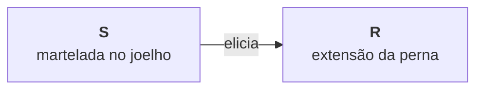

<!--
Aula 02. A aula 01 foi filosófica: nenhum conceito técnico foi apresentado. Esta é
a primeira aula de conteúdo, e vale dizer isso de saída — a turma sai daqui com um
vocabulário técnico que será usado em todas as aulas seguintes.
-->

---
layout: agenda
kicker: Três horas, seis partes
title: O caminho de hoje
items:
  - { topic: "O reflexo — estímulo e resposta" }
  - { topic: "As leis do reflexo" }
  - { topic: "Emoções como respondente" }
  - { topic: "O reflexo aprendido — Pavlov" }
  - { topic: "Emoções aprendidas — Watson" }
  - { topic: "Enfraquecer um reflexo" }
---

<!--
A trilha no topo do slide mostra em qual das seis partes a aula está. Vale apontar
para ela uma vez, no começo, para que a turma saiba que existe.

Os seis itens vão sem `desc` de propósito: com a linha de descrição o slide passava
da altura e o tema o encolhia até o piso de 0,7.
-->

---
layout: default
kicker: De onde viemos
title: A aula 01 abriu espaço; esta aula começa a ocupá-lo
---

Encerramos a aula passada com uma exigência: se causas mentais não explicam, é preciso oferecer **explicações não mentalistas** do comportamento.

- A primeira delas é a mais antiga e a mais simples: o **reflexo**
- Ela cobre uma faixa estreita do comportamento — mas cobre bem
- É também a base do que veremos nas aulas seguintes

<!--
Anuncie a mudança de registro: hoje não há controvérsia filosófica, há definição
e exemplo. Alunos que acharam a aula 01 abstrata costumam se recuperar aqui.
-->

---
layout: section
index: "01"
kicker: Parte um
title: O reflexo
subtitle: Uma relação entre ambiente e organismo — não uma coisa que o organismo tem
---

---
layout: default
kicker: Exemplos
title: Todos nós já observamos isto
---

<v-clicks>

- O médico bate o martelo no joelho e a perna se estende
- A luz incide sobre a pupila e ela se contrai
- Um barulho alto e repentino soa e o coração dispara
- Entramos numa sala muito quente e começamos a suar
- O seio da mãe toca a boca do bebê e ele suga
- Uma superfície pontiaguda toca o pé do bebê e ele recolhe a perna

</v-clicks>

<Callout v-click icon="lucide:scan-search">
Há algo em comum em todos eles: uma <strong>alteração no ambiente</strong> produz uma <strong>alteração no organismo</strong>.
</Callout>

<!--
Peça à turma que encontre o padrão antes de você enunciá-lo. Quase sempre alguém
diz "é automático" ou "não é escolhido" — aproveite: é exatamente disso que vamos
falar na Parte 3, quando o assunto for emoção.
-->

---
layout: define
kicker: O conceito central
term: Reflexo
definition: Não é o que o organismo fez. É uma relação entre o que ele fez e o que aconteceu antes.
points:
  - "Na linguagem cotidiana, reflexo é sinônimo de resposta: «aquele goleiro tem bom reflexo»"
  - "Em psicologia, reflexo é a relação entre um estímulo e uma resposta"
  - "É um tipo de interação entre um organismo e seu ambiente"
  - "Reflexos inatos estão presentes desde o nascimento, e até antes dele"
---

<!-- Este é o erro conceitual número um do capítulo 1, e ele reaparece na prova:
o aluno escreve "o reflexo do bebê é sugar". Não é. Sugar é a resposta; o reflexo
é a relação «contato na boca → sucção». -->

---
layout: vs
kicker: Duas acepções da mesma palavra
title: Reflexo no dia a dia × reflexo em psicologia
label: ×
left:
  title: Uso cotidiano
  items:
    - "«Aquele goleiro tem um reflexo rápido»"
    - "«O reflexo da luz cegou seu olho»"
    - "«Você tem bons reflexos»"
    - "Refere-se ao que o indivíduo <strong>fez</strong>"
    - "É um atributo da pessoa"
right:
  title: Uso técnico
  items:
    - "«Batida no joelho → extensão da perna»"
    - "«Luz na pupila → contração da pupila»"
    - "«Barulho alto → taquicardia»"
    - "Refere-se a uma <strong>relação</strong>"
    - "É uma interação organismo-ambiente"
---

<!-- Vale escrever no quadro os dois lados. A migração de sentido é o obstáculo
principal do capítulo: a palavra é familiar, o conceito não. -->

---
layout: define
kicker: Os dois termos que compõem o reflexo
term: Estímulo e resposta
definition: "<strong>Estímulo</strong>: uma parte ou uma mudança em uma parte do ambiente. <strong>Resposta</strong>: uma mudança no organismo."
points:
  - "Estímulo e ambiente andam juntos; resposta e organismo andam juntos"
  - "«Fogo próximo à mão» é estímulo: não havia fogo, agora há"
  - "«Contração do braço» é resposta: o braço não estava contraído, agora está"
  - "Um não existe, tecnicamente, sem o outro"
---

<!-- Aqui é útil pedir exemplos da turma e classificá-los no quadro em duas colunas.
Erros produtivos: «medo» (resposta), «a prova de amanhã» (estímulo), «ansiedade»
(resposta). O exercício prepara a Parte 3. -->

---
layout: default
kicker: Exercício de leitura
title: Cinco reflexos, decompostos
---

<Tabela
  :dados="[
    ['Estímulo (ambiente)', 'Resposta (organismo)'],
    ['Fogo próximo à mão', 'contração do braço'],
    ['Martelada no joelho', 'extensão da perna'],
    ['Luz forte sobre o olho', 'contração da pupila'],
    ['Ar frio sobre a pele', 'arrepio'],
    ['Cheiro de comida', 'salivação'],
  ]"
  cabecalho
  realce="coluna:1"
/>

<Callout icon="lucide:arrow-right">
Cada linha é <strong>um reflexo</strong>: a seta entre as colunas é parte do conceito.
</Callout>

<!-- Se sobrar tempo, apague a segunda coluna e peça que a turma a preencha; depois
faça o inverso. É a Tabela 1.2 do livro, transformada em atividade oral. -->

---
layout: diagram
kicker: A notação
title: Como a análise do comportamento escreve um reflexo
note: <strong>S</strong> para estímulo, <strong>R</strong> para resposta, a seta
  para a relação. Quando há mais de um reflexo em jogo, entram índices —
  S1, S2, R1, R2.
---

<!--
O verbo técnico é ELICIAR: o estímulo elicia a resposta. Ele carrega a ideia de
produção automática, e vai contrastar com o verbo da próxima aula, quando o
comportamento for selecionado por consequências em vez de eliciado por estímulos.
Insista no verbo: "a martelada elicia a extensão", nunca "causa" ou "faz".
-->

---
layout: define
kicker: As duas medidas
term: Intensidade e magnitude
definition: "<strong>Intensidade</strong> é o quanto de estímulo. <strong>Magnitude</strong> é o quanto de resposta."
points:
  - "No reflexo patelar: a força da martelada é a intensidade; o tamanho da extensão é a magnitude"
  - "Numa sala quente: a temperatura é a intensidade; a quantidade de suor é a magnitude"
  - "Sem esses dois conceitos, as leis do reflexo não podem ser enunciadas"
---

<!-- Os dois termos são pré-requisito da Parte 2 inteira. Se a turma sair confundindo
intensidade com magnitude, as quatro leis viram decoreba. -->

---
layout: default
kicker: Por que medir importa
title: Medir comportamento é ofício do psicólogo
---

<Tabela
  :dados="[
    ['', 'Evento', 'Uma forma de medir'],
    ['S', 'Luz sobre o olho', 'lúmens'],
    ['S', 'Choque elétrico', 'volts'],
    ['R', 'Salivação', 'gotas de saliva'],
    ['R', 'Taquicardia', 'batimentos por minuto'],
    ['R', 'Sudorese', 'mililitros de suor'],
  ]"
  cabecalho
  realce="coluna:1"
  compacta
/>

<Callout tom="alerta" icon="lucide:ruler">
Até o leigo faz referência a medidas: <em>«você ficou com muito medo?»</em>. Muito, pouco, mais, menos são medidas ruins — mas são medidas. Nosso trabalho é torná-las melhores.
</Callout>

<!-- Esse slide costuma ser o primeiro contato do aluno com a exigência de mensuração,
e ele volta em avaliação funcional, em linha de base e no registro de sessão. -->

---
layout: section
index: "02"
kicker: Parte dois
title: As leis do reflexo
subtitle: Três séculos de pesquisa em busca de relações constantes entre estímulo e resposta
---

---
layout: default
kicker: O que é uma «lei» aqui
title: O objetivo de uma ciência é achar relações constantes
---

Pesquisadores estudaram reflexos de humanos e não-humanos buscando regularidades que se repetissem **nos mais diversos reflexos e nas mais diversas espécies**.

- O que encontraram são as **leis do reflexo**, também chamadas propriedades
- Não são decretos: descrevem como a relação S→R se comporta
- Valem para o reflexo inato e também para o aprendido

<Callout icon="lucide:book-open">
Hoje veremos <strong>intensidade-magnitude</strong>, <strong>limiar</strong>, <strong>latência</strong> e os efeitos das <strong>eliciações sucessivas</strong>.
</Callout>

<!-- Deixe claro que "lei" aqui tem o sentido das ciências naturais: uma regularidade
observada, revisável. É coerente com o pragmatismo discutido na aula 01. -->

---
layout: define
kicker: Primeira lei
term: Lei da intensidade-magnitude
definition: Quanto maior a intensidade do estímulo, maior a magnitude da resposta.
points:
  - "Quanto mais alto o barulho, maior o susto"
  - "Quanto mais claro o dia ao abrir a janela, mais as pupilas se contraem"
  - "Quanto mais quente a sala, mais se transpira"
  - "Quanto mais forte a martelada, maior a extensão da perna"
---

<!-- É a lei mais intuitiva, e por isso a melhor para introduzir o formato "quanto
maior X, maior Y". As duas seguintes usam a mesma forma, invertendo o sinal. -->

---
layout: define
kicker: Segunda lei
term: Lei do limiar
definition: Para todo reflexo existe uma intensidade mínima de estímulo necessária para que a resposta seja eliciada.
points:
  - "Abaixo do limiar, o estímulo não elicia resposta alguma"
  - "Acima do limiar, elicia"
  - "Uma luz fraca demais não contrai a pupila; um toque leve demais não elicia retirada"
  - "O valor do limiar é individual — não é o mesmo para todas as pessoas"
---

<!-- Exemplo do livro: a contração muscular eliciada por choque elétrico. Os valores
que ele dá (5 a 10 volts) são explicitamente fictícios; use-os só como ilustração. -->

---
layout: diagram
kicker: Uma sutileza do limiar
title: O limiar é uma faixa, não um ponto
note: Abaixo da faixa o estímulo <strong>nunca</strong> elicia a resposta; acima
  dela, elicia <strong>sempre</strong>. Dentro dela, às vezes elicia e às vezes
  não.
---

<svg viewBox="0 0 960 300" role="img" aria-label="Gráfico da lei do limiar: abaixo da faixa o estímulo nunca elicia a resposta, dentro da faixa às vezes elicia e às vezes não, acima da faixa elicia sempre.">
  <rect x="430" y="40" width="150" height="200" rx="10" fill="var(--acento-claro)" />
  <text x="505" y="28" text-anchor="middle" style="font-family:var(--fonte-corpo);font-size:21px;font-weight:700" fill="var(--acento)">limiar</text>
  <line x1="150" y1="240" x2="918" y2="240" stroke="var(--linha-forte)" stroke-width="3" />
  <path d="M 916 231 L 936 240 L 916 249 Z" fill="var(--linha-forte)" />
  <text x="138" y="88" text-anchor="end" style="font-family:var(--fonte-corpo);font-size:20px;font-weight:600" fill="var(--acento)">elicia</text>
  <text x="138" y="203" text-anchor="end" style="font-family:var(--fonte-corpo);font-size:20px" fill="var(--frente-2)">não elicia</text>
  <g fill="none" stroke="var(--frente-2)" stroke-width="3">
    <circle cx="185" cy="196" r="9" /><circle cx="235" cy="196" r="9" /><circle cx="285" cy="196" r="9" /><circle cx="335" cy="196" r="9" /><circle cx="385" cy="196" r="9" /><circle cx="455" cy="196" r="9" /><circle cx="505" cy="196" r="9" />
  </g>
  <g fill="var(--acento)">
    <circle cx="480" cy="81" r="9" /><circle cx="530" cy="81" r="9" /><circle cx="558" cy="81" r="9" /><circle cx="625" cy="81" r="9" /><circle cx="675" cy="81" r="9" /><circle cx="725" cy="81" r="9" /><circle cx="775" cy="81" r="9" /><circle cx="825" cy="81" r="9" /><circle cx="875" cy="81" r="9" />
  </g>
  <text x="540" y="286" text-anchor="middle" style="font-family:var(--fonte-corpo);font-size:21px" fill="var(--frente-2)">intensidade do estímulo →</text>
</svg>

<!--
É a Figura 1.5 do livro. A zona de incerteza é a regra, não a exceção: dois testes
idênticos no mesmo paciente podem dar resultados diferentes sem que nenhum deles
esteja errado. Variabilidade aqui não é erro de medida, é propriedade do fenômeno.
-->

---
layout: define
kicker: Terceira lei
term: Lei da latência
definition: Latência é o tempo entre o estímulo e a resposta. Quanto maior a intensidade do estímulo, menor a latência.
points:
  - "Quanto mais alto o barulho, mais rápido vem o susto"
  - "Quanto mais quente a superfície, mais depressa a mão se afasta"
  - "É a única das leis em que a relação é inversa"
  - "Latência é, em geral, o nome de um intervalo entre dois eventos"
---

<!-- Chame atenção para o sinal invertido: as outras leis dizem "maior → maior";
esta diz "maior → menor". Erro clássico de prova. -->

---
layout: default
kicker: Uma quarta relação, do mesmo tipo
title: A intensidade também governa a duração
---

Além da latência, a intensidade do estímulo tem relação **diretamente proporcional** com a duração da resposta.

Quando um vento frio passa pela pele, nós nos arrepiamos. Você já teve arrepios mais demorados que outros: **quanto mais frio, mais tempo dura o arrepio**.

<Callout icon="lucide:timer">
Três medidas da resposta, então, dependem da intensidade do estímulo: <strong>magnitude</strong>, <strong>latência</strong> e <strong>duração</strong>.
</Callout>

<!-- Resumo útil no quadro: intensidade ↑ → magnitude ↑, latência ↓, duração ↑. -->

---
layout: vs
kicker: Eliciações sucessivas
title: O que acontece quando o mesmo estímulo se repete
label: ×
left:
  title: Habituação
  items:
    - "A magnitude da resposta <strong>diminui</strong>"
    - "Cortar muitas cebolas: os olhos lacrimejam menos a cada uma"
    - "O barulho da obra ao lado deixa de assustar"
    - "O cheiro forte de um ambiente deixa de ser notado"
right:
  title: Potenciação
  items:
    - "A magnitude da resposta <strong>aumenta</strong>"
    - "É o efeito oposto, e ocorre em outros reflexos"
    - "Cada nova eliciação produz resposta mais forte"
    - "Depende de qual reflexo está em jogo"
---

<!-- Condição necessária para os dois efeitos: mesmo estímulo, mesma intensidade,
várias vezes seguidas, em curtos intervalos. Se o intervalo for longo, o efeito
não aparece — e isso importa na hora de planejar uma exposição terapêutica. -->

---
layout: diagram
kicker: Figuras 1.7 e 1.8
title: Os dois efeitos, lado a lado
note: O eixo horizontal é o número da eliciação; o vertical, a magnitude da
  resposta. <strong>Mesmo estímulo, mesma intensidade</strong> — só o que muda é
  quantas vezes ele já foi apresentado.
---

<svg viewBox="0 0 960 300" role="img" aria-label="Dois gráficos de barras. À esquerda, habituação: a magnitude da resposta decresce a cada eliciação sucessiva. À direita, potenciação: a magnitude cresce.">
  <text x="255" y="26" text-anchor="middle" style="font-family:var(--fonte-corpo);font-size:22px;font-weight:700" fill="var(--frente)">Habituação</text>
  <g fill="var(--frente-2)">
    <rect x="100" y="90" width="42" height="150" rx="4" /><rect x="152" y="120" width="42" height="120" rx="4" /><rect x="204" y="148" width="42" height="92" rx="4" /><rect x="256" y="172" width="42" height="68" rx="4" /><rect x="308" y="192" width="42" height="48" rx="4" /><rect x="360" y="208" width="42" height="32" rx="4" />
  </g>
  <line x1="90" y1="240" x2="420" y2="240" stroke="var(--linha-forte)" stroke-width="3" />
  <text x="255" y="272" text-anchor="middle" style="font-family:var(--fonte-corpo);font-size:19px" fill="var(--frente-2)">eliciações sucessivas →</text>
  <line x1="480" y1="40" x2="480" y2="270" stroke="var(--linha)" stroke-width="2" stroke-dasharray="8 8" />
  <text x="725" y="26" text-anchor="middle" style="font-family:var(--fonte-corpo);font-size:22px;font-weight:700" fill="var(--acento)">Potenciação</text>
  <g fill="var(--acento)">
    <rect x="570" y="200" width="42" height="40" rx="4" /><rect x="622" y="178" width="42" height="62" rx="4" /><rect x="674" y="154" width="42" height="86" rx="4" /><rect x="726" y="130" width="42" height="110" rx="4" /><rect x="778" y="108" width="42" height="132" rx="4" /><rect x="830" y="85" width="42" height="155" rx="4" />
  </g>
  <line x1="560" y1="240" x2="890" y2="240" stroke="var(--linha-forte)" stroke-width="3" />
  <text x="725" y="272" text-anchor="middle" style="font-family:var(--fonte-corpo);font-size:19px" fill="var(--frente-2)">eliciações sucessivas →</text>
</svg>

<!-- Pergunte à turma qual dos dois descreve o corte de cebolas e qual descreve um
barulho que vai ficando insuportável. O desenho torna a pergunta respondível de
imediato; em bullets, ela vira decoreba de duas palavras parecidas. -->

---
layout: default
kicker: Fechando a parte dois
title: As leis do reflexo em um quadro
---

<Tabela
  :dados="[
    ['Lei', 'O que estabelece'],
    ['Intensidade-magnitude', 'intensidade maior → magnitude maior'],
    ['Limiar', 'abaixo de uma intensidade mínima, não há resposta'],
    ['Latência', 'intensidade maior → latência menor'],
    ['Duração', 'intensidade maior → resposta mais duradoura'],
    ['Habituação', 'eliciações sucessivas → magnitude decrescente'],
    ['Potenciação', 'eliciações sucessivas → magnitude crescente'],
  ]"
  cabecalho
  realce="coluna:1"
/>

<!-- Este é o quadro para copiar. Todas as seis linhas voltam no capítulo 2, agora
aplicadas a reflexos aprendidos: elas não valem só para o inato. -->

---
layout: section
index: "03"
kicker: Parte três
title: Emoções como comportamento respondente
subtitle: Por que é tão difícil «controlar» uma emoção — e por que isso não é um mistério
---

---
layout: define
kicker: A tese do fim do capítulo 1
term: Respostas emocionais
definition: Boa parte do que chamamos de emoção são respostas reflexas a estímulos ambientais.
points:
  - "Medo, alegria, raiva, tristeza, excitação — respostas, não coisas"
  - "Nascemos preparados para responder emocionalmente a certos estímulos"
  - "Isso vale para nós e para as demais espécies"
  - "Comportamento respondente é outro nome para comportamento reflexo"
---

<!-- Registre o sinônimo: reflexo = respondente. O título da aula usa os dois termos,
e a literatura alterna entre eles sem avisar. -->

---
layout: default
kicker: Um esclarecimento necessário
title: Emoções não surgem do nada
---

Não sentimos medo, alegria ou raiva sem motivo. Sentimos essas emoções **quando algo acontece**.

- A situação que elicia a emoção nem sempre é aparente
- Isso não significa que ela não exista
- Ela pode ser um pensamento, uma lembrança, uma música, uma palavra

<Callout icon="lucide:search">
Quando não encontramos o estímulo, a conclusão correta não é «veio de dentro» — é que <strong>ainda não o identificamos</strong>. O capítulo 2 vai explicar por que ele costuma ser difícil de achar.
</Callout>

<!-- Aqui a aula 01 volta: dizer que a emoção "veio de dentro" é exatamente a ficção
explicativa que Baum descreveu. Vale nomear isso em voz alta. -->

---
layout: default
kicker: O corpo na emoção
title: Boa parte do que chamamos emoção é fisiologia
---

Quando sentimos medo, uma série de reações fisiológicas ocorre:

- As glândulas supra-renais secretam **adrenalina**
- Os vasos sanguíneos periféricos se **contraem** (ficar branco de medo)
- O sangue se **concentra nos músculos**

O mesmo vale para raiva, alegria, ansiedade e tristeza — outras mudanças fisiológicas, detectáveis com aparelhos próprios.

<Callout tom="alerta" icon="lucide:pill">
É por isso que ansiolíticos e antidepressivos funcionam: eles <strong>não afetam a mente</strong>, afetam o organismo e sua fisiologia.
</Callout>

<!-- Esse argumento costuma convencer alunos resistentes ao behaviorismo: a própria
psiquiatria trata o corpo, não a mente. -->

---
layout: statement
kicker: A consequência prática
title: É tão difícil não sentir medo diante do estímulo quanto não chutar quando o martelo bate no joelho.
---

<!-- Deixe respirar. Esta frase reorganiza o modo como o aluno vai olhar para o
paciente fóbico: ninguém decide ter medo, do mesmo modo que ninguém decide o
reflexo patelar. Dizer a um fóbico que seu medo é irracional adianta pouco ou nada. -->

---
layout: default
kicker: Por que responder emocionalmente
title: O valor de sobrevivência das respostas emocionais
---

Responder emocionalmente a certos estímulos mostrou, ao longo da evolução, **valor de sobrevivência**. Um animal atacado por um predador apresenta as respostas que chamamos de medo:

- O sangue sai da superfície da pele → arranhões sangram menos
- O sangue se concentra nos músculos → corre mais e reage com mais força

<Callout tom="bom" icon="lucide:shield">
Essas respostas tornam <strong>mais provável</strong> que o animal escape com vida. O mesmo vale para as demais emoções, inclusive as agradáveis.
</Callout>

<!-- Este é o elo com a aula 01: hereditariedade (filogênese) é uma das duas origens
do comportamento. A outra, o ambiente, é o assunto da Parte 4. -->

---
layout: section
index: "04"
kicker: Parte quatro
title: O reflexo aprendido
subtitle: Pavlov, o emparelhamento de estímulos e o vocabulário do condicionamento
---

---
layout: default
kicker: O problema que a aprendizagem resolve
title: Reflexos inatos são uma preparação — e o ambiente muda
---

Os reflexos inatos preparam a espécie para um primeiro contato com o ambiente. Mas o ambiente **muda constantemente**, e uma preparação fixa envelhece.

<Callout icon="lucide:refresh-cw">
Por isso as espécies desenvolveram outra capacidade, também de grande valor para a sobrevivência: a de <strong>aprender novos reflexos</strong> — reagir de formas diferentes a estímulos novos.
</Callout>

<!-- A distinção filogênese × ontogênese aparece aqui pela primeira vez, mesmo sem
esses nomes: o inato é herdado da espécie, o aprendido é adquirido na vida do
indivíduo. Se a turma já viu os termos, use-os. -->

---
layout: steps
kicker: O exemplo do livro
title: Da fruta amarela à fruta vermelha
steps:
  - { title: O reflexo inato, desc: "a toxina da fruta elicia vômito e náusea", icon: "lucide:dna" }
  - { title: O ambiente muda, desc: "o animal migra; ali a fruta tóxica é vermelha", icon: "lucide:map" }
  - { title: O emparelhamento, desc: "ele come a fruta vermelha e, logo depois, passa mal", icon: "lucide:link" }
  - { title: O reflexo aprendido, desc: "ver a fruta vermelha passa a eliciar náusea — e ele não a come mais", icon: "lucide:eye-off" }
---

<!-- Note a estrutura: o reflexo novo é construído SOBRE um reflexo que já existia.
Nada se cria do zero; um estímulo antes irrelevante toma emprestada a função de um
estímulo que já eliciava a resposta. Essa frase resume o capítulo 2 inteiro. -->

---
layout: default
kicker: 1849–1936
title: Ivan Petrovich Pavlov e uma descoberta acidental
---

Pavlov, fisiologista russo, estudava o reflexo salivar: **alimento na boca → salivação**. Uma fístula junto às glândulas salivares do cão permitia medir a saliva produzida.

Ele percebeu que **outros estímulos** também eliciavam salivação:

- A visão do local onde o alimento era apresentado
- O som de seus passos ao chegar ao laboratório
- A aproximação da hora habitual dos experimentos

<Callout icon="lucide:lightbulb">
Nada disso deveria eliciar salivação. Pavlov decidiu estudar o acidente.
</Callout>

<!-- Vale comentar que Pavlov não era psicólogo e não procurava aprendizagem: procurava
fisiologia da digestão. O achado é um bom exemplo do que a aula 01 chamou de ciência
que parte da observação, e não de pressupostos. -->

---
layout: diagram
kicker: Figuras 2.1 e 2.2
title: O aparato experimental
note: O cão contido no aparato, a fístula junto à glândula salivar e o tubo que
  leva a saliva ao recipiente graduado — é assim que a <strong>magnitude da
  resposta</strong> vira número.
---

<svg viewBox="0 0 960 300" role="img" aria-label="Espaço reservado para a imagem do laboratório de Pavlov.">
  <rect x="5" y="5" width="950" height="290" rx="14" fill="var(--fundo-2)" stroke="var(--linha-forte)" stroke-width="3" stroke-dasharray="14 11" />
  <text x="480" y="118" text-anchor="middle" fill="var(--acento)" style="font-family:var(--fonte-corpo);font-size:20px;font-weight:700;letter-spacing:2px">IMAGEM A INSERIR</text>
  <text x="480" y="163" text-anchor="middle" fill="var(--frente)" style="font-family:var(--fonte-corpo);font-size:24px">O laboratório de Pavlov: o cão no aparato, a fístula e o tubo coletor</text>
  <text x="480" y="205" text-anchor="middle" fill="var(--frente-2)" style="font-family:var(--fonte-mono);font-size:19px">aulas/public/pavlov-aparato.jpg</text>
</svg>

<!--
PLACEHOLDER. Para trocar por uma imagem de verdade:
  1. salve o arquivo em aulas/public/pavlov-aparato.jpg
  2. apague o bloco <svg> acima e ponha no lugar exatamente esta linha:
     
O tema já limita a imagem à altura do quadro (regra `.quadro img` em
tema/styles/base.css); nada de CSS no .md.
-->

---
layout: timeline
kicker: Três marcos do respondente
title: O percurso que esta aula cobre
events:
  - { date: "1904", title: "Pavlov", desc: "Nobel pelo estudo da digestão; do reflexo salivar sai o reflexo aprendido" }
  - { date: "1920", title: "Watson", desc: "o caso do pequeno Albert leva o condicionamento às emoções humanas" }
  - { date: "1982", title: "Ader e Cohen", desc: "condicionamento de respostas imunológicas — o alcance do fenômeno" }
---

<!-- Os três marcos servem de mapa: onde o fenômeno foi descoberto, onde ele foi
estendido ao humano e até onde ele chega. Ader e Cohen voltam na Parte 5. -->

---
layout: steps
kicker: O experimento clássico
title: Como Pavlov produziu um reflexo novo
steps:
  - { title: "Antes", desc: "o som da sineta não elicia salivação; a carne elicia", icon: "lucide:bell-off" }
  - { title: "Emparelhamento", desc: "som da sineta e, logo em seguida, carne — cerca de 60 vezes", icon: "lucide:link" }
  - { title: "Teste", desc: "apenas o som da sineta, e a saliva é medida", icon: "lucide:flask-conical" }
  - { title: "Depois", desc: "o som sozinho elicia salivação: um reflexo novo foi aprendido", icon: "lucide:bell" }
---

<!--
Emparelhar é apresentar um estímulo e, logo em seguida, o outro. O número 60 é o do
experimento relatado; não é um requisito — a Parte 5 mostra casos de um único
emparelhamento. O que define o procedimento é a ordem e a proximidade no tempo.
-->

---
layout: diagram
kicker: O paradigma
title: As três situações do condicionamento
note: NS e CS são <strong>o mesmo estímulo</strong>. O nome muda porque a
  <em>função</em> dele mudou.
---

<svg viewBox="0 0 960 300" role="img" aria-label="As três situações do condicionamento pavloviano. Antes: o som da sineta não elicia salivação, e a carne elicia. Durante: sineta e carne são emparelhadas repetidas vezes. Depois: o som da sineta sozinho elicia salivação.">
  <rect x="0" y="12" width="960" height="140" rx="10" fill="var(--fundo-2)" />
  <rect x="0" y="228" width="960" height="70" rx="10" fill="var(--acento-claro)" />
  <g style="font-family:var(--fonte-corpo);font-size:19px;font-weight:700" fill="var(--acento)">
    <text x="14" y="51">1 · Antes</text><text x="14" y="197">2 · Durante</text><text x="14" y="271">3 · Depois</text>
  </g>
  <g style="font-family:var(--fonte-corpo);font-size:20px" text-anchor="middle">
    <rect x="160" y="20" width="200" height="48" rx="8" fill="var(--superficie)" stroke="var(--linha-forte)" stroke-width="2" stroke-dasharray="7 6" />
    <text x="260" y="51" fill="var(--frente-2)">NS · sineta</text>
    <rect x="480" y="20" width="240" height="48" rx="8" fill="none" stroke="var(--linha)" stroke-width="2" stroke-dasharray="7 6" />
    <text x="600" y="51" fill="var(--frente-2)">salivação</text>
    <text x="420" y="32" fill="var(--frente-2)" style="font-size:16px">não elicia</text>
    <rect x="160" y="90" width="200" height="48" rx="8" fill="var(--superficie)" stroke="var(--frente-2)" stroke-width="2" />
    <text x="260" y="121" fill="var(--frente)">US · carne</text>
    <rect x="480" y="90" width="240" height="48" rx="8" fill="var(--superficie)" stroke="var(--frente-2)" stroke-width="2" />
    <text x="600" y="121" fill="var(--frente)">UR · salivação</text>
    <text x="420" y="102" fill="var(--frente-2)" style="font-size:16px">elicia</text>
    <rect x="160" y="166" width="300" height="48" rx="8" fill="var(--superficie)" stroke="var(--frente-2)" stroke-width="2" />
    <text x="310" y="197" fill="var(--frente)">NS + US · sineta, depois carne</text>
    <rect x="570" y="166" width="230" height="48" rx="8" fill="var(--superficie)" stroke="var(--frente-2)" stroke-width="2" />
    <text x="685" y="197" fill="var(--frente)">UR · salivação</text>
    <text x="515" y="178" fill="var(--frente-2)" style="font-size:16px">repetido</text>
    <rect x="160" y="240" width="200" height="48" rx="8" fill="var(--superficie)" stroke="var(--acento)" stroke-width="3" />
    <text x="260" y="271" fill="var(--acento)" style="font-weight:700">CS · sineta</text>
    <rect x="480" y="240" width="240" height="48" rx="8" fill="var(--superficie)" stroke="var(--acento)" stroke-width="3" />
    <text x="600" y="271" fill="var(--acento)" style="font-weight:700">CR · salivação</text>
    <text x="420" y="252" fill="var(--acento)" style="font-size:16px">elicia</text>
  </g>
  <g stroke-width="3" fill="none">
    <path d="M 372 44 L 462 44" stroke="var(--linha-forte)" stroke-dasharray="8 7" />
    <path d="M 372 114 L 462 114" stroke="var(--frente-2)" />
    <path d="M 460 114 L 446 107 L 446 121 Z" fill="var(--frente-2)" stroke="none" />
    <path d="M 472 190 L 562 190" stroke="var(--frente-2)" />
    <path d="M 566 190 L 552 183 L 552 197 Z" fill="var(--frente-2)" stroke="none" />
    <path d="M 372 264 L 462 264" stroke="var(--acento)" />
    <path d="M 466 264 L 452 257 L 452 271 Z" fill="var(--acento)" stroke="none" />
  </g>
</svg>

<!-- As siglas vêm do inglês: unconditioned stimulus, unconditioned response, neutral
stimulus, conditioned stimulus, conditioned response. Escreva-as por extenso no quadro
uma vez; depois use só as siglas, como a literatura faz. -->

---
layout: default
kicker: O vocabulário
title: Cinco siglas, e nenhuma delas é opcional
---

<Tabela
  :dados="[
    ['Sigla', 'Nome', 'No experimento de Pavlov'],
    ['NS', 'estímulo neutro', 'o som da sineta, antes do condicionamento'],
    ['US', 'estímulo incondicionado', 'a carne'],
    ['UR', 'resposta incondicionada', 'salivar diante da carne'],
    ['CS', 'estímulo condicionado', 'o som da sineta, depois do condicionamento'],
    ['CR', 'resposta condicionada', 'salivar diante do som'],
  ]"
  cabecalho
  realce="linha:5"
/>

<!-- Cobre essas cinco siglas em toda avaliação. O par que mais confunde é NS/CS:
é o MESMO estímulo, nomeado conforme a função que exerce naquele momento. -->

---
layout: vs
kicker: Dois reflexos, não um
title: Reflexo incondicionado × reflexo condicionado
label: ×
left:
  title: Reflexo incondicionado
  items:
    - "US → UR"
    - "Carne → salivação"
    - "<strong>Não depende</strong> de aprendizagem"
    - "É o reflexo inato do capítulo 1"
    - "É o ponto de apoio do condicionamento"
right:
  title: Reflexo condicionado
  items:
    - "CS → CR"
    - "Som da sineta → salivação"
    - "<strong>Depende</strong> de aprendizagem"
    - "Foi construído por emparelhamento"
    - "Pode ser desfeito — veja a Parte 6"
---

<!-- Insista: um reflexo condicionado só se constrói a partir de um reflexo que já
existe. Sem US, não há o que emprestar ao NS. -->

---
layout: define
kicker: Uma advertência sobre os termos
term: Neutro, incondicionado e condicionado são termos <em>relativos</em>
definition: Nenhum estímulo é neutro ou incondicionado em si. Ele é neutro ou incondicionado para uma resposta.
points:
  - "A carne é um estímulo incondicionado para salivar"
  - "A mesma carne é um estímulo neutro para arrepiar"
  - "O som da sineta é neutro para salivar e pode ser incondicionado para outra resposta"
  - "Por isso a pergunta certa nunca é «que estímulo é esse?», e sim «para qual resposta?»"
---

<!-- Este slide separa quem entendeu de quem decorou. Peça exemplos: "o cheiro de
café é US para quê? é NS para quê?" -->

---
layout: default
kicker: Emparelhar não basta — o condicionamento <em>pode</em> ocorrer
title: Quatro fatores que decidem se o reflexo se instala
---

<Tabela
  :dados="[
    ['Fator', 'O que fortalece o condicionamento'],
    ['Frequência', 'mais emparelhamentos CS-US, CR mais forte'],
    ['Tipo', 'o CS vem antes do US e permanece quando ele chega'],
    ['Intensidade do US', 'um US forte condiciona mais rápido'],
    ['Predição', 'o CS precisa anunciar o US de forma confiável'],
  ]"
  cabecalho
  realce="linha:5"
/>

<!-- O grau de predição é o fator mais moderno da lista e antecipa Rescorla: um som
que às vezes precede a comida e às vezes não condiciona pior que um som confiável.
Pavlov já havia observado que o intervalo ótimo gira em torno de meio segundo. -->

---
layout: section
index: "05"
kicker: Parte cinco
title: Emoções aprendidas
subtitle: Watson e Albert, a história de condicionamento de cada um, e como um reflexo se espalha
---

---
layout: default
kicker: Juntando as partes 3 e 4
title: Se aprendemos reflexos, aprendemos emoções
---

Emoções são, em grande parte, relações entre estímulos e respostas — são comportamento respondente. E reflexos podem ser aprendidos.

<Callout tom="bom" icon="lucide:git-merge">
Segue-se que os organismos podem <strong>aprender a sentir emoções</strong> que não estavam em seu repertório quando nasceram.
</Callout>

Foi exatamente isso que Watson foi verificar em 1920, num experimento que ficou conhecido como **o caso do pequeno Albert**.

<!-- Este é o slide da dedução: a conclusão sai de duas premissas que a turma já
aceitou. Deixe que a turma complete a frase antes de você revelá-la. -->

---
layout: steps
kicker: Watson, 1920
title: O procedimento com o pequeno Albert
steps:
  - { title: "Verificar o US", desc: "som estridente de uma haste de metal elicia choro e contração — reflexo inato", icon: "lucide:hammer" }
  - { title: "Verificar o NS", desc: "diante de um rato branco, o bebê demonstra interesse e tenta tocá-lo", icon: "lucide:search" }
  - { title: "Emparelhar", desc: "quando Albert toca o rato, Watson bate na haste; algumas repetições", icon: "lucide:link" }
  - { title: "Testar", desc: "apenas o rato, e Albert responde como respondia ao som: medo condicionado", icon: "lucide:activity" }
---

<!-- Note o rigor do desenho: Watson não presume o US nem o NS, ele testa os dois
antes. É o mesmo cuidado que se espera de uma avaliação funcional em clínica. -->

---
layout: diagram
kicker: Figuras 2.5 e 2.8
title: O registro do experimento
note: Nos registros da generalização, Albert reage do mesmo modo a estímulos
  parecidos com o rato branco — um cão branco, um animal de pelúcia, uma barba
  branca.
---

<svg viewBox="0 0 960 300" role="img" aria-label="Espaço reservado para a imagem do experimento com o pequeno Albert.">
  <rect x="5" y="5" width="950" height="290" rx="14" fill="var(--fundo-2)" stroke="var(--linha-forte)" stroke-width="3" stroke-dasharray="14 11" />
  <text x="480" y="118" text-anchor="middle" fill="var(--acento)" style="font-family:var(--fonte-corpo);font-size:20px;font-weight:700;letter-spacing:2px">IMAGEM A INSERIR</text>
  <text x="480" y="163" text-anchor="middle" fill="var(--frente)" style="font-family:var(--fonte-corpo);font-size:24px">O pequeno Albert diante do rato branco e da barba branca</text>
  <text x="480" y="205" text-anchor="middle" fill="var(--frente-2)" style="font-family:var(--fonte-mono);font-size:19px">aulas/public/albert.jpg</text>
</svg>

<!--
PLACEHOLDER. Para trocar por uma imagem de verdade:
  1. salve o arquivo em aulas/public/albert.jpg
  2. apague o bloco <svg> acima e ponha no lugar exatamente esta linha:
     

As fotos originais são fotogramas do filme de Watson e Rayner, de 1920, e circulam
amplamente em manuais. Se for publicar o site, confira a procedência do arquivo que
usar antes de subir.
-->

---
layout: default
kicker: Uma observação necessária
title: O experimento hoje não seria aprovado
---

O caso de Albert é o exemplo canônico de condicionamento de respostas emocionais em humanos, e por isso está em todos os manuais.

<Callout tom="ruim" icon="lucide:shield-alert">
Ele também é um exemplo de pesquisa que os comitês de ética atuais <strong>não autorizariam</strong>: produzir medo em um bebê, sem procedimento previsto para desfazê-lo, viola os padrões vigentes de pesquisa com seres humanos.
</Callout>

Estudamos o procedimento pelo que ele demonstra — não como modelo de conduta.

<!-- Vale gastar um minuto aqui. Alunos frequentemente conhecem o caso pela polêmica
e não pelo conceito; nomear a questão ética evita que ela sequestre a discussão
conceitual e mostra que a crítica é nossa também. -->

---
layout: columns
kicker: Por que cada um sente uma coisa
title: A resposta está na história de condicionamento
columns:
  - title: "Medos"
    items:
      - "Acidente ao dirigir na chuva → medo de dirigir na chuva"
      - "Barulho do motor do dentista → tensão e sudorese"
  - title: "Náuseas e sabores"
    items:
      - "Comida estragada → náusea diante daquele cheiro"
      - "Basta um emparelhamento para instalar-se"
  - title: "Afeto e prazer"
    items:
      - "Velas emparelhadas a intimidade → excitação diante de velas"
      - "Uma música ligada a um período feliz → bem-estar"
---

<!-- Todos esses exemplos estão no capítulo 2. O ponto é responder à pergunta que a
turma sempre faz: por que o mesmo estímulo elicia coisas diferentes em pessoas
diferentes? Porque as histórias de emparelhamento foram diferentes. -->

---
layout: default
kicker: O que parece inato e não é
title: Respostas emocionais condicionadas comuns
---

Conhecemos tanta gente com **medo de altura** que a suposição natural é que se trate de uma característica inata do ser humano.

- Mas é difícil encontrar alguém que nunca tenha caído de algum lugar alto
- A visão da altura (NS) foi emparelhada ao impacto e à dor da queda (US)
- Depois disso, a simples visão da altura elicia medo

<Callout icon="lucide:mic">
Mesma estrutura no <strong>medo de falar em público</strong>: é comum encontrar quem o tenha, e igualmente comum encontrar quem tenha passado por uma situação constrangedora ao falar em público.
</Callout>

<!-- Aqui o critério é o da aula 01: antes de postular uma disposição inata, procure
a história. Emoções compartilhadas costumam sair de condicionamentos compartilhados,
não de uma natureza humana. -->

---
layout: define
kicker: Um reflexo não fica onde nasceu
term: Generalização respondente
definition: Depois do condicionamento, estímulos fisicamente semelhantes ao CS passam a eliciar a CR.
points:
  - "Quem passou por uma situação aversiva com uma galinha teme outras galinhas — e outras aves"
  - "A semelhança em jogo é física: cor, tamanho, textura, forma"
  - "Partes do CS bastam: o bico, as penas, as pernas"
  - "Watson observou o fenômeno em Albert — barba branca, cão branco, animal de pelúcia"
---

<!-- Sem generalização, um reflexo condicionado seria quase inútil: só serviria para
o estímulo exato da aprendizagem. É ela que torna o fenômeno relevante na clínica —
e é ela que sustenta a dessensibilização sistemática, na Parte 6. -->

---
layout: diagram
kicker: A generalização tem grau
title: O gradiente de generalização
note: A magnitude da resposta depende do <strong>grau de semelhança</strong> entre
  o estímulo apresentado e o CS original — no exemplo, o pastor alemão que atacou.
---

<svg viewBox="0 0 960 300" role="img" aria-label="Gráfico de barras decrescentes: o pastor alemão que atacou elicia o medo de maior magnitude; outro pastor alemão, um cão de outra raça, um cão pequeno e um cão de pelúcia eliciam medos progressivamente menores.">
  <g>
    <rect x="70" y="40" width="130" height="180" rx="6" fill="var(--acento)" />
    <rect x="240" y="80" width="130" height="140" rx="6" fill="var(--acento)" opacity="0.78" />
    <rect x="410" y="120" width="130" height="100" rx="6" fill="var(--acento)" opacity="0.56" />
    <rect x="580" y="158" width="130" height="62" rx="6" fill="var(--acento)" opacity="0.36" />
    <rect x="750" y="190" width="130" height="30" rx="6" fill="var(--acento)" opacity="0.22" />
  </g>
  <line x1="50" y1="220" x2="900" y2="220" stroke="var(--linha-forte)" stroke-width="3" />
  <g fill="var(--frente)" text-anchor="middle" style="font-family:var(--fonte-corpo);font-size:19px">
    <text x="135" y="248">o pastor alemão</text><text x="135" y="271">que atacou</text>
    <text x="305" y="248">outro pastor</text><text x="305" y="271">alemão</text>
    <text x="475" y="248">outra raça,</text><text x="475" y="271">porte parecido</text>
    <text x="645" y="248">cão pequeno,</text><text x="645" y="271">bem diferente</text>
    <text x="815" y="248">cão de</text><text x="815" y="271">pelúcia</text>
  </g>
  <text x="20" y="130" fill="var(--frente-2)" transform="rotate(-90 20 130)" text-anchor="middle" style="font-family:var(--fonte-corpo);font-size:19px">magnitude do medo</text>
</svg>

<!-- É a Figura 2.7. Essa gradação não é um detalhe: é a régua que o psicólogo usa
para montar a hierarquia de ansiedade da dessensibilização sistemática, na Parte 6.
Anuncie isso agora — a última barra, o cão de pelúcia, é o primeiro degrau da
hierarquia, e ela ainda elicia medo. -->

---
layout: define
kicker: A partir de um CS, outro reflexo
term: Condicionamento de ordem superior
definition: Um estímulo neutro emparelhado a um estímulo condicionado — e não a um incondicionado — também passa a eliciar a CR.
points:
  - "Pavlov: carne (US) + sineta (NS) → a sineta vira CS para salivar"
  - "Depois: sineta (CS) + quadro-negro (NS) → o quadro-negro passa a eliciar salivação"
  - "O novo reflexo é de <strong>segunda ordem</strong>; o processo pode continuar"
  - "Quanto mais alta a ordem, <strong>menor a força</strong> do reflexo"
---

<!-- É o emparelhamento CS-NS, em contraste com o US-NS que vimos até aqui. Este
processo explica boa parte do repertório emocional adulto: quase nada do que nos
emociona hoje foi emparelhado diretamente a um estímulo incondicionado. -->

---
layout: default
kicker: Ordem superior no cotidiano
title: A música do casal
---

Muitos casais têm uma música especial. Ela foi emparelhada a beijos e carícias do primeiro encontro, e tornou-se **CS** para respostas semelhantes às que essas carícias eliciavam.

- A foto do cantor, presente quando a música tocava, passa a eliciar respostas parecidas
- O som do nome do cantor, também
- Cada passo adiante é um reflexo de ordem mais alta — e mais fraco

<Callout icon="lucide:trending-down">
A magnitude decresce ao longo da cadeia: nome do cantor &lt; música &lt; beijos e carícias.
</Callout>

<!-- Peça exemplos da turma. Cheiros, lugares, horários e músicas aparecem sempre,
e é um bom momento para mostrar que a análise do comportamento tem o que dizer
sobre a vida afetiva — objeção comum de quem chega ao curso. -->

---
layout: default
kicker: Um caso que merece atenção
title: Palavras são estímulos como quaisquer outros
---

Dizer a um bebê de três meses «você é um inútil» provavelmente o fará sorrir. Dizer o mesmo a um adulto elicia emoções desagradáveis. **O que mudou?**

Palavras faladas são **estímulos auditivos**. Sua carga emocional vem de condicionamento:

- «Bife» emparelhado ao próprio bife pode passar a eliciar salivação
- «Burro», «feio» e «errado» costumam ser ouvidos em situações de punição
- Junto com a dor e o medo, essas palavras passam a eliciar respostas semelhantes

<Callout tom="alerta" icon="lucide:volume-2">
Por extensão, a voz e a simples visão do agressor tornam-se CS. É por isso que algumas crianças ficam paralisadas na presença dos pais.
</Callout>

<!-- Este slide costuma ser o mais lembrado da aula. Ele também é a ponte para
comportamento verbal, mais adiante no curso: por ora, basta o efeito eliciador. -->

---
layout: panels
kicker: O alcance do fenômeno
title: Duas aplicações fora da clínica
panels:
  - icon: "lucide:activity"
    title: Sistema imunológico
    items:
      - "Ader e Cohen (1982): ratos recebem água com açúcar e uma droga imunossupressora"
      - "Após vários emparelhamentos, a água com açúcar sozinha suprime a imunidade"
      - "Aplicação possível: reduzir a dose de imunossupressor em transplantados"
  - icon: "lucide:tv"
    title: Publicidade
    items:
      - "O produto (NS) é emparelhado a pessoas e situações de que se gosta (US)"
      - "Repetido muitas vezes, o produto passa a eliciar respostas agradáveis"
      - "A ordem importa: primeiro o produto, logo depois a cena agradável"
---

<!-- Ader e Cohen mostram que o condicionamento alcança respostas que não imaginaríamos
condicionáveis. A publicidade mostra que o procedimento é usado todo dia, com ou sem
o nome técnico — e que a ordem CS→US é exatamente a que Pavlov descreveu. -->

---
layout: section
index: "06"
kicker: Parte seis
title: Enfraquecer um reflexo
subtitle: Extinção, recuperação espontânea e as duas técnicas que a clínica usa para tornar o processo suportável
---

---
layout: define
kicker: O procedimento e o processo
term: Extinção respondente
definition: Apresentar o CS repetidas vezes sem o US ao qual foi emparelhado, até que ele deixe de eliciar a CR.
points:
  - "O efeito eliciador do CS se extingue gradualmente"
  - "Pavlov: a sineta sozinha, muitas vezes, e o cão deixa de salivar ao som"
  - "Quem aprendeu a ter medo pode aprender a não ter mais"
  - "É o princípio por trás dos tratamentos de fobia"
---

<!-- Distinga procedimento (o que o psicólogo faz) de processo (o que acontece ao
reflexo). O livro usa a palavra para os dois, e a distinção é cobrada em prova. -->

---
layout: default
kicker: Um exemplo do começo ao fim
title: Medo de andar de carro depois de um acidente
---

Durante o acidente, estímulos incondicionados para medo — barulho, impacto súbito, dor — foram emparelhados a um estímulo neutro: **estar dentro do carro**.

- Depois disso, entrar no carro (CS) elicia medo (CR)
- Esse medo só deixará de ocorrer se a pessoa **se expuser ao carro**
- E se expuser **sem** os estímulos incondicionados do acidente

<Callout tom="bom" icon="lucide:car">
Não é preciso apagar a memória do acidente nem convencer ninguém de nada. É preciso que o CS ocorra repetidamente <strong>desacompanhado</strong> do US.
</Callout>

<!-- Repare no que a explicação NÃO exige: nada de trauma reprimido, nada de insight.
A intervenção decorre diretamente da descrição do processo — é o poder pragmático
que a aula 01 atribuiu às boas explicações. -->

---
layout: default
kicker: A armadilha
title: Por que carregamos medos a vida inteira
---

Se a extinção exige contato com o CS, então **evitar o CS impede a extinção**.

- Por emparelhamentos da infância, alguém passa a ter medo de altura
- Consequentemente, evita lugares altos sempre que pode
- Sem contato com o CS, o reflexo nunca perde força
- E o medo o acompanha pelo resto da vida

<Callout tom="alerta" icon="lucide:repeat">
Se a mesma pessoa precisar trabalhar na construção de prédios, ela se exporá a lugares altos em segurança — e provavelmente o medo deixará de ocorrer.
</Callout>

<!-- Este slide é o que mais rende clinicamente. Ele descreve, em termos respondentes,
por que a esquiva mantém a fobia. Na aula sobre operante, ele reaparece: a esquiva é
mantida por suas próprias consequências. -->

---
layout: define
kicker: A extinção não é uma linha reta
term: Recuperação espontânea
definition: Depois de extinto, o reflexo pode voltar a ter força — sem novos emparelhamentos.
points:
  - "Alguém com medo de altura permanece à beira de um lugar alto até o medo cessar"
  - "Dias depois, no mesmo lugar, o medo reaparece"
  - "Reaparece <strong>mais fraco</strong> do que era antes da extinção"
  - "Nova exposição ao CS sem o US e as chances de nova recuperação diminuem"
---

<!-- Avise a turma: um paciente que volta dizendo "voltou tudo" não fracassou, e o
tratamento não fracassou. A recuperação espontânea é esperada, e é mais fraca a cada
ciclo. Saber disso muda o que se diz ao paciente na sessão seguinte. -->

---
layout: diagram
kicker: O curso do processo
title: O curso da extinção
note: O que volta depois do intervalo volta <strong>mais fraco</strong>. Nova
  exposição ao CS sem o US e as chances de outra recuperação diminuem.
---

<svg viewBox="0 0 960 300" role="img" aria-label="Curva da força do reflexo condicionado. Ela decresce até quase zero ao longo das apresentações do CS sem o US; depois de um intervalo, reaparece num pico mais baixo e volta a decrescer.">
  <line x1="90" y1="240" x2="918" y2="240" stroke="var(--linha-forte)" stroke-width="3" />
  <path d="M 916 231 L 936 240 L 916 249 Z" fill="var(--linha-forte)" />
  <line x1="90" y1="30" x2="90" y2="240" stroke="var(--linha-forte)" stroke-width="3" />
  <polyline points="110,55 160,88 210,120 260,152 310,180 360,203 410,220 460,231" fill="none" stroke="var(--acento)" stroke-width="5" stroke-linejoin="round" stroke-linecap="round" />
  <line x1="500" y1="30" x2="500" y2="255" stroke="var(--frente-2)" stroke-width="2" stroke-dasharray="8 8" />
  <text x="500" y="22" text-anchor="middle" fill="var(--frente-2)" style="font-family:var(--fonte-corpo);font-size:18px">alguns dias sem contato</text>
  <polyline points="540,150 590,175 640,198 690,215 740,228 790,235 840,238" fill="none" stroke="var(--acento)" stroke-width="5" stroke-linejoin="round" stroke-linecap="round" />
  <circle cx="540" cy="150" r="8" fill="var(--acento)" />
  <text x="180" y="46" fill="var(--acento)" style="font-family:var(--fonte-corpo);font-size:20px;font-weight:700">extinção</text>
  <text x="560" y="132" fill="var(--acento)" style="font-family:var(--fonte-corpo);font-size:20px;font-weight:700">recuperação espontânea</text>
  <text x="26" y="135" fill="var(--frente-2)" transform="rotate(-90 26 135)" text-anchor="middle" style="font-family:var(--fonte-corpo);font-size:19px">força da CR</text>
  <text x="504" y="285" text-anchor="middle" fill="var(--frente-2)" style="font-family:var(--fonte-corpo);font-size:19px">apresentações do CS sem o US →</text>
</svg>

<!-- Este é o gráfico para deixar no quadro durante toda a Parte 6. Ele responde
sozinho à pergunta que sempre aparece: "então o medo nunca some de vez?". Some —
mas por ciclos, e cada pico é menor que o anterior. -->

---
layout: default
kicker: O limite prático da extinção
title: Por que não expor a pessoa diretamente
---

Você já sabe como fazer alguém perder um medo. Mas alguns estímulos eliciam respostas fortes demais para a exposição direta. Trancar quem tem fobia de aves num quarto cheio de aves não funciona:

- Dificilmente se convenceria alguém a fazer isso
- O medo pode ser tão intenso que a pessoa desmaia — e sai do contato com o CS
- O sofrimento causado foge às normas éticas e ao bom senso

<Callout icon="lucide:life-buoy">
Duas técnicas resolvem o impasse: <strong>contracondicionamento</strong> e <strong>dessensibilização sistemática</strong>.
</Callout>

<!-- O segundo motivo é o mais interessante tecnicamente: desmaiar interrompe o
contato com o CS, ou seja, a exposição excessiva impede a própria extinção. -->

---
layout: define
kicker: Primeira técnica
term: Contracondicionamento
definition: Emparelhar o CS a um estímulo que elicia a resposta contrária àquela que se quer enfraquecer.
points:
  - "Se o CS elicia ansiedade, emparelha-se o CS a algo que elicia relaxamento"
  - "Música suave e massagem são os exemplos usuais"
  - "A nova resposta é incompatível com a antiga"
  - "Também funciona na direção oposta, para tornar aversivo o que era agradável"
---

<!-- A direção oposta é o exemplo do cigarro no livro: fumar elicia prazer; o xarope
de ipeca elicia vômito. Emparelhados, fumar passa a eliciar náusea. É um exemplo
histórico de terapia aversiva — comente também que ela é hoje pouco usada e
eticamente controversa, para que a turma não a tome como recomendação. -->

---
layout: default
kicker: O exemplo do livro, em três momentos
title: Contracondicionamento na direção aversiva
---

<Tabela
  :dados="[
    ['Momento', 'Relações em jogo'],
    ['1 · Os reflexos originais', 'fumar → prazer / xarope de ipeca → vômito'],
    ['2 · O contracondicionamento', 'fumar e, logo depois, tomar o xarope — várias vezes'],
    ['3 · O resultado', 'fumar → náusea, e a chance de continuar fumando diminui'],
  ]"
  cabecalho
  realce="linha:4"
/>

<Callout tom="alerta" icon="lucide:scale">
O procedimento é eficaz e por isso está no livro. Sua indicação, hoje, é restrita: produzir sofrimento como parte do tratamento exige justificativa clínica e consentimento.
</Callout>

<!-- Se a turma perguntar por que estudar algo pouco usado: porque o princípio é o
mesmo que sustenta o contracondicionamento por relaxamento, que é usadíssimo. -->

---
layout: define
kicker: Segunda técnica
term: Dessensibilização sistemática
definition: Dividir a extinção em pequenos passos, subindo por uma hierarquia de ansiedade.
points:
  - "Baseia-se diretamente na generalização respondente e no gradiente"
  - "Constrói-se uma escala crescente de intensidade, para aquela pessoa"
  - "Cada passo é enfrentado até que deixe de eliciar a resposta"
  - "Só então se passa ao seguinte"
---

<!-- Amarre com a Parte 5: sem gradiente de generalização não haveria hierarquia
possível. A técnica só existe porque estímulos parecidos eliciam respostas
proporcionalmente menores. -->

---
layout: steps
kicker: Uma hierarquia de ansiedade
title: Do menor ao maior — o caso do medo de cães
steps:
  - { title: "Pensar e ver", desc: "pensar em cães; depois, ver fotografias de cães", icon: "lucide:image" }
  - { title: "Tocar o substituto", desc: "tocar cães de pelúcia", icon: "lucide:teddy-bear" }
  - { title: "Observar de longe", desc: "cães bem diferentes daquele que atacou, à distância", icon: "lucide:binoculars" }
  - { title: "Aproximar e tocar", desc: "observar de perto, depois tocar — até entrar no canil sem medo", icon: "lucide:dog" }
---

<!-- A hierarquia é construída COM o paciente, e é dele: o que é o segundo passo para
um pode ser o quinto para outro. Isso decorre de a história de condicionamento ser
individual — o ponto que fechamos na Parte 5. -->

---
layout: default
kicker: Na prática, juntas
title: As duas técnicas costumam ser usadas em conjunto
---

É muito comum, na prática psicológica, combinar dessensibilização sistemática e contracondicionamento.

<Callout tom="bom" icon="lucide:layers">
No caso do medo de cães: a exposição gradual aos estímulos da hierarquia acontece <strong>enquanto</strong> uma música suave elicia relaxamento — a resposta incompatível com a ansiedade.
</Callout>

Cada passo da hierarquia é, ao mesmo tempo, uma exposição ao CS sem o US e um emparelhamento do CS com um estímulo relaxante.

<!-- Vale explicitar que o psicólogo não escolheu entre as técnicas: ele desenhou um
procedimento em que os dois processos ocorrem juntos. É assim que a análise do
comportamento aplicada costuma trabalhar. -->

---
layout: default
kicker: Síntese
title: Os fenômenos do comportamento respondente
---

<Tabela
  :dados="[
    ['Fenômeno', 'Em uma frase'],
    ['Condicionamento pavloviano', 'NS emparelhado a US passa a eliciar a resposta'],
    ['Generalização respondente', 'estímulos parecidos com o CS também eliciam a CR'],
    ['Gradiente de generalização', 'quanto mais parecido, maior a magnitude'],
    ['Ordem superior', 'um NS emparelhado a um CS também passa a eliciar'],
    ['Extinção respondente', 'CS sem US, repetidas vezes, e a CR se enfraquece'],
    ['Recuperação espontânea', 'depois de extinto, o reflexo pode voltar — mais fraco'],
  ]"
  cabecalho
  realce="coluna:1"
/>

<!-- Este é o quadro de revisão. Peça um exemplo novo para cada linha; exemplo novo,
inventado pelo aluno, é a melhor evidência de que o conceito foi aprendido. -->

---
layout: columns
kicker: O que deve sobrar da aula
title: Três frases
columns:
  - title: "1 · Reflexo é relação"
    items:
      - "Não é o que o organismo faz, é a relação entre <strong>estímulo</strong> e <strong>resposta</strong>"
      - "Estímulo elicia resposta"
  - title: "2 · Reflexos se aprendem"
    items:
      - "Por <strong>emparelhamento</strong> de um estímulo neutro a um já eliciador"
      - "É daí que vem boa parte das nossas emoções"
  - title: "3 · E se desfazem"
    items:
      - "Por <strong>exposição ao CS sem o US</strong>"
      - "A clínica torna esse processo suportável"
---

<!-- Se a turma sair com três frases, que sejam estas. Cada uma corresponde a duas
das seis partes da aula. -->

---
layout: statement
kicker: A ideia que sustenta a aula
title: Ninguém decide sentir medo — e é justamente por isso que o medo pode ser modificado.
---

<!-- A frase é deliberadamente paradoxal para o senso comum: o determinismo da aula 01
não retira o controle, ele é a condição para que haja controle. Se a emoção fosse
livre, nada do que vimos hoje funcionaria. -->

---
layout: end
title: Até a próxima
subtitle: "Aula 03 — A aprendizagem pelas consequências: o comportamento operante."
contact: "Leitura de hoje: Moreira & Medeiros (2007), capítulos 1 e 2 · Princípios básicos de análise do comportamento"
---
