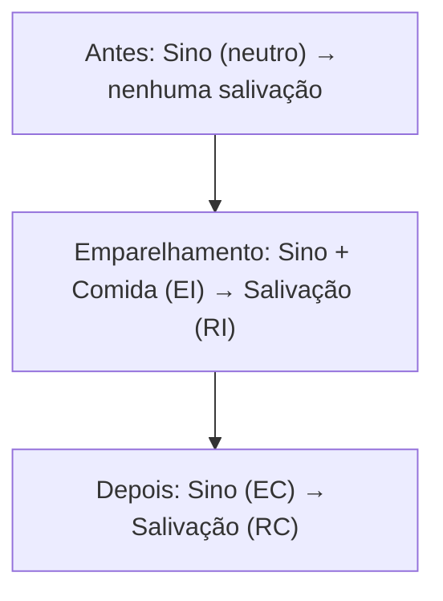

---
layout: agenda
kicker: Aula 02
title: O caminho de hoje
items:
  - { topic: Respondente, desc: "o ambiente que provoca" }
  - { topic: Operante, desc: "o ambiente que seleciona" }
  - { topic: Reforço e punição, desc: "quatro contingências, duas confusões" }
  - { topic: Esquemas, desc: "por que o intermitente resiste tanto" }
---

---
layout: section
index: "1"
kicker: Parte um
title: Condicionamento respondente
subtitle: Quando o comportamento é arrancado do organismo
---

---
layout: define
kicker: Pavlov, 1897
term: Condicionamento respondente
definition: Um estímulo neutro passa a eliciar uma resposta reflexa por ser emparelhado com um estímulo que já a eliciava.
points:
  - "A resposta é eliciada — o organismo não escolhe"
  - "Envolve sobretudo respostas do sistema autônomo"
  - "É a base do medo condicionado, da ansiedade e da náusea antecipatória"
---

---
layout: diagram
kicker: O processo
title: Como o sino passa a valer por comida
note: Depois do emparelhamento, o que era neutro vira <strong>EC</strong> — e elicia sozinho uma resposta que antes não eliciava.
build: true
---

---
layout: two-cols
kicker: Na clínica
title: O respondente que chega ao consultório
---

Nem sempre vem com nome de reflexo:

- **Fobia** — elevador emparelhado com pânico
- **Ansiedade antecipatória** — o e-mail do chefe elicia taquicardia
- **Náusea antecipatória** — o cheiro do hospital, antes da quimioterapia

::right::

<Callout icon="lucide:flask-conical">
<strong>Extinção respondente</strong> — apresentar o EC sem o EI, repetidamente, até a resposta condicionada enfraquecer. É o mecanismo por trás da exposição.
</Callout>

<Callout tone="warn" icon="lucide:rotate-ccw">
Extinção não apaga o aprendido: ela aprende por cima. Por isso existe <strong>recuperação espontânea</strong>.
</Callout>

<!-- Vale reforçar: exposição não é 'enfrentar o medo pela coragem'. É um procedimento com mecanismo descrito, e o mecanismo é este. -->

---
layout: bigtype
kicker: A virada da aula
title: Até aqui, o ambiente <em>provoca</em>. Agora ele passa a <em>selecionar</em>.
---

---
layout: section
index: "2"
kicker: Parte dois
title: Condicionamento operante
subtitle: O comportamento que age sobre o mundo e volta modificado
---

---
layout: define
kicker: Skinner, 1938
term: Condicionamento operante
definition: O comportamento é emitido e selecionado pelas suas consequências.
points:
  - "Não há estímulo que o arranque — há contexto que o torna provável"
  - "O que muda a probabilidade futura é o que vem depois"
  - "É aprendizagem por seleção, não por associação"
---

---
layout: panels
kicker: A unidade operante
title: A contingência de três termos
panels:
  - { icon: "lucide:map-pin", title: "A · Antecedente", items: ["O contexto em que ocorre", "Sinaliza a consequência provável", "Não causa: ocasiona"] }
  - { icon: "lucide:activity", title: "B · Comportamento", items: ["O que o organismo faz", "Descrito, não interpretado", "Mensurável: frequência, duração"] }
  - { icon: "lucide:repeat", title: "C · Consequência", items: ["O que o ambiente devolve", "Seleciona o que se repete", "Só ela define reforço ou punição"] }
---

<!-- Escreva A-B-C no quadro e deixe lá o resto do semestre. Toda a aula 03 é aplicar isso. -->

---
layout: compare
kicker: O quadro que todo mundo erra
title: Positivo e negativo não são bom e ruim
columns: [Contingência, O que o ambiente faz, Efeito na frequência, Exemplo]
rows:
  - { metric: "Reforço positivo", before: "Acrescenta algo", after: "Aumenta", delta: "Elogio após a tarefa" }
  - { metric: "Reforço negativo", before: "Remove algo aversivo", after: "Aumenta", delta: "Tomar analgésico tira a dor" }
  - { metric: "Punição positiva", before: "Acrescenta algo aversivo", after: "Diminui", delta: "Bronca após a piada" }
  - { metric: "Punição negativa", before: "Remove algo apreciado", after: "Diminui", delta: "Perder o celular por uma semana" }
---

---
layout: statement
kicker: A regra de leitura
title: "<em>Positivo</em> e <em>negativo</em> dizem se algo entrou ou saiu. <em>Reforço</em> e <em>punição</em> dizem se a frequência subiu ou desceu."
---

---
layout: two-cols
kicker: Por que insistir nisso
title: Reforço negativo não é punição
---

O erro clássico: chamar de "reforço negativo" qualquer coisa desagradável.

Mas **reforço sempre aumenta** a frequência. O negativo apenas descreve que algo aversivo **saiu**.

<Badge tone="good">aumenta</Badge> reforço · <Badge tone="bad">diminui</Badge> punição

::right::

<Callout tone="warn" icon="lucide:triangle-alert">
<strong>É por isso que a esquiva é tão difícil de tratar.</strong> Não sair de casa remove a ansiedade — e essa remoção reforça o não sair. O alívio é o reforçador.
</Callout>

O comportamento problema costuma estar sendo mantido por reforço negativo. Ele **funciona** — esse é o problema.

<!-- Este slide é o coração da aula para quem vai atender. Se só um conceito ficar, que seja este. -->

---
layout: steps
kicker: Como o novo aparece
title: Modelagem — reforço de aproximações sucessivas
ghost: "→"
steps:
  - { title: "Definir o alvo", desc: "o comportamento final, descrito com precisão", icon: "lucide:target" }
  - { title: "Achar o ponto de partida", desc: "algo que o repertório já emite", icon: "lucide:play" }
  - { title: "Reforçar a aproximação", desc: "o que se parece um pouco com o alvo", icon: "lucide:thumbs-up" }
  - { title: "Elevar o critério", desc: "só a aproximação melhor passa a ser reforçada", icon: "lucide:trending-up" }
  - { title: "Manter", desc: "afinar o esquema para o comportamento resistir", icon: "lucide:anchor" }
---

---
layout: reference
kicker: Esquemas de reforço
title: Nem todo reforço é a cada vez
groups:
  - title: Razão (por número de respostas)
    items:
      - { term: "FR — razão fixa", desc: "reforço a cada N respostas · alta taxa, pausa após o reforço" }
      - { term: "VR — razão variável", desc: "a cada N em média · taxa altíssima e muito resistente" }
  - title: Intervalo (por tempo)
    items:
      - { term: "FI — intervalo fixo", desc: "primeira resposta após T · aceleração perto do fim" }
      - { term: "VI — intervalo variável", desc: "após T em média · taxa estável e constante" }
---

<!-- Pergunte quem já ficou puxando a tela para atualizar o feed. VR, ao vivo. -->

---
layout: feature
kicker: A consequência prática
title: O VR está por toda parte
columns: 3
features:
  - { icon: "lucide:dices", title: "Caça-níquel", desc: "paga às vezes, e por isso não se para" }
  - { icon: "lucide:smartphone", title: "Feed infinito", desc: "a maioria dos posts é chata; alguns não" }
  - { icon: "lucide:baby", title: "O quinto pedido", desc: "ceder de vez em quando ensina a insistir" }
---

---
layout: two-cols
kicker: Resistência à extinção
title: Por que o intermitente resiste mais
---

Se o reforço vinha **sempre**, a ausência é fácil de discriminar — o comportamento cai rápido.

Se vinha **às vezes**, ausência é indistinguível de uma sequência ruim. O organismo insiste.

<Meter value="20" label="Contínuo — extinção rápida" tone="bad" />
<Meter value="85" label="Intermitente — extinção lenta" tone="good" />

::right::

<Callout icon="lucide:lightbulb">
Por isso ceder <strong>de vez em quando</strong> à birra é pior que ceder sempre: transforma um esquema contínuo num VR.
</Callout>

<Callout tone="warn" icon="lucide:trending-up">
E espere o <strong>surto de extinção</strong>: antes de cair, a resposta piora. Quem não avisa a família disso perde a adesão na primeira semana.
</Callout>

---
layout: vs
kicker: Fechando
title: Os dois processos, lado a lado
label: ×
left:
  title: Respondente
  items:
    - "Eliciado pelo antecedente"
    - "Reflexo, involuntário"
    - "Aprende por emparelhamento"
    - "Extinção: EC sem EI"
right:
  title: Operante
  items:
    - "Emitido, selecionado pela consequência"
    - "Voluntário, sob controle do contexto"
    - "Aprende por consequência"
    - "Extinção: retirar o reforçador"
---

---
layout: statement
kicker: A síntese
title: Comportamento não se explica pelo que a pessoa <em>é</em> — se explica pelo que o ambiente <em>faz</em> quando ela age.
---

---
layout: end
title: Até a próxima
subtitle: "Aula 03 — análise funcional: descobrir a função de um comportamento específico"
contact: Leitura · Catania, cap. 4–6 · Skinner (1953), cap. 4–5
---
