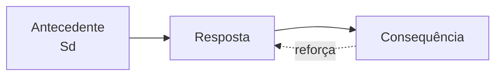
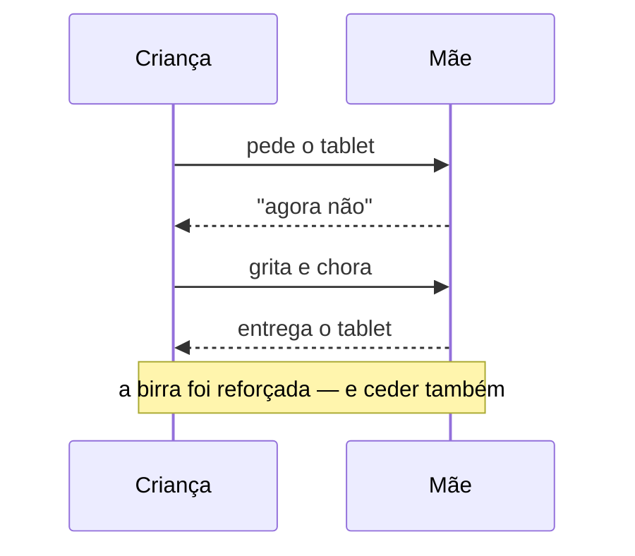

<!--
COMO USAR ESTE DECK
  npx slidev referencia-tahta.md --open     abre com hot reload
  tecla `o`                                 mostra todos os slides de uma vez (visão geral)
  tecla `d`                                 alterna claro/escuro
Este arquivo mora na RAIZ, fora de aulas/ — o build só publica aulas/*.md, então ele nunca
vai para o GitHub Pages. É material de bancada.

LAYOUT `cover` — recomendado para: o primeiro slide de uma aula, quando você quer o título
centrado e formal. Se quiser uma abertura mais dramática, use `lead` (é o que as aulas 01-03 usam).
Lembre: o bloco de abertura é headmatter E frontmatter do slide 1 ao mesmo tempo — o `title:`
do deck já é o título da capa, não repita.
-->

---
layout: default
kicker: Antes de tudo
title: As três regras que quebram deck
---

- **Nada de CSS, `<style>` ou HTML de layout** — escolha o `layout:` e preencha o frontmatter
- **Todo frontmatter é cercado por `---` em cima e embaixo** — duas linhas `---` seguidas entre slides sem corpo está certo
- **Número no `value:` fica pelado** — o símbolo vai no `unit:` (`value: 80`, `unit: "%"`)
- Só duas coisas aceitam HTML em título: `<em>ênfase</em>` e `<span class="accent2">destaque</span>`
- Rode `npx tahta-lint aulas/*.md` antes de commitar

<!--
LAYOUT `default` — recomendado para: qualquer conteúdo em bullets ou prosa. É a tela em branco
do tema. Se o slide tem no máximo ~6 bullets curtos, `default` resolve. Acima disso, quebre em
dois slides ou troque por um layout com forma (`panels`, `columns`, `steps`).
O corpo do `default` também aceita componentes — é lá que os slides ficam bonitos.
-->

---
layout: agenda
kicker: Este catálogo
title: O que tem aqui dentro
items:
  - { topic: Aberturas e transições, desc: "cover, lead, bigtype, section, statement, quote" }
  - { topic: Conteúdo estruturado, desc: "define, agenda, columns, panels, vs, compare, reference" }
  - { topic: Processo e tempo, desc: "steps, timeline, feature, logos, diagram" }
  - { topic: Números e dados, desc: "stats, fact, metric, chart" }
  - { topic: Mídia e código, desc: "image, showcase, bleed, embed, code, code-explain" }
  - { topic: Componentes, desc: "os 17 que você compõe dentro do corpo" }
  - { topic: Campos universais, desc: "bg, ghost, glow, foot, aside, v-clicks" }
---

<!--
LAYOUT `agenda` — recomendado para: o segundo slide da aula ("o caminho de hoje"), ou para
abrir um bloco longo. Cada item é `{ topic, desc }`: o topic é o rótulo, o desc é a promessa.
Não use como lista de conteúdo genérica — para isso existe `columns` ou `panels`.
-->

---
layout: section
index: "01"
kicker: Parte um
title: Aberturas e transições
subtitle: Os layouts que não carregam conteúdo — carregam ritmo.
---

<!--
LAYOUT `section` — recomendado para: dividir a aula em partes. Use 3 a 6 numa aula de 50 min.
Bônus escondido: quando o deck tem `section`, o tema desenha uma trilha de progresso fina no
topo dos slides, e a turma sabe em que parte está. Vale só por isso.
Campos: index (o número gigante de fundo), kicker, title, subtitle.
-->

---
layout: lead
index: "01"
kicker: Psicologia Comportamental · FASM
title: A abertura que <em>respira</em>.
subtitle: Título ancorado embaixo à esquerda, com muito espaço vazio em cima.
---

<!--
LAYOUT `lead` — recomendado para: abrir a aula quando você quer drama em vez de formalidade.
É a alternativa assimétrica ao `cover`, e é o padrão das aulas 01-03 deste repo.
Diferença prática: `cover` centraliza e é neutro; `lead` joga o texto para o canto e usa o vazio
como recurso. Numa aula com número ("Aula 03"), o `index:` fica lindo.
-->

---
layout: bigtype
kicker: A virada
title: Pare de perguntar <em>o que ele é</em>. Pergunte <em>o que aconteceu</em>.
---

<!--
LAYOUT `bigtype` — recomendado para: o momento de pontuação. Uma frase só, ocupando o slide
inteiro, que faz a turma parar. Use nas viradas de raciocínio: depois de mostrar o problema e
antes de mostrar a saída. O texto se auto-ajusta ao quadro, então frase curta rende mais.
Regra de ouro: no máximo 2 ou 3 num deck — se tudo é grito, nada é grito.
-->

---
layout: statement
kicker: Ponto de partida
title: "«Ele bateu no colega porque é agressivo.» E como sabemos que ele é agressivo? Porque bate."
---

<!--
LAYOUT `statement` — recomendado para: uma tese, uma pergunta provocativa ou uma citação curta
que você quer que fique sozinha no centro da tela. Parece com `bigtype`, mas é mais contido:
`bigtype` é tipografia gritada de borda a borda; `statement` é uma frase centrada, com respiro.
Corpo vazio — o texto vem do frontmatter. Se a frase começa com «, aspas no YAML.
-->

---
layout: quote
quote: A conduta é o resultado de uma história de consequências, não de uma essência interior.
author: Skinner, parafraseado
---

<!--
LAYOUT `quote` — recomendado para: citação de autor, depoimento de paciente, fala de um caso
clínico. Só dois campos: quote e author. Se a frase é SUA tese e não de outra pessoa, use
`statement` — o `quote` sinaliza visualmente "isto é fala de alguém".
-->

---
layout: section
index: "02"
kicker: Parte dois
title: Conteúdo estruturado
subtitle: Quando o conteúdo já tem forma, existe um layout com essa forma.
---

<!--
Dica de composição: alternar seções assim dá ritmo ao deck e alimenta a trilha de progresso.
-->

---
layout: define
kicker: A definição
term: Contingência de três termos
definition: A relação entre <span class="accent2">antecedente</span>, resposta e consequência — a unidade de análise do comportamento operante.
points:
  - "Antecedente: o contexto em que a resposta ocorre"
  - "Resposta: o que o organismo faz"
  - "Consequência: o que o ambiente devolve"
---

<!--
LAYOUT `define` — recomendado para: introduzir um termo técnico. É o layout mais útil de uma
aula teórica — praticamente todo conceito novo cabe aqui. Estrutura: term (o nome),
definition (uma frase, HTML permitido) e points (os desdobramentos).
Detalhe raro e útil: `define` é o ÚNICO layout que renderiza LaTeX no frontmatter
(em definition/points). Para fórmula em qualquer outro lugar, escreva $...$ no CORPO do slide.
-->

---
layout: columns
kicker: Duas listas paralelas
title: Respondente e operante
columns:
  - { title: "Respondente (Pavlov)", items: ["Eliciado pelo antecedente", "Musculatura lisa, glândulas", "Reflexo condicionado", "O ambiente vem ANTES"] }
  - { title: "Operante (Skinner)", items: ["Emitido, depois selecionado", "Musculatura estriada", "Contingência de três termos", "O ambiente vem DEPOIS"] }
---

<!--
LAYOUT `columns` — recomendado para: 2 ou 3 listas paralelas que a turma lê em conjunto.
Cada coluna é `{ title, items }` (ou `body` com HTML, no lugar de items).
Como escolher entre os primos:
  `columns` → listas paralelas, 2-3, sem drama visual
  `vs`      → confronto A contra B, com divisor no meio (mais retórico)
  `compare` → tabela antes/depois com números, linha a linha
  `panels`  → cartões com ícone, quando cada bloco é um subtópico e não uma lista
-->

---
layout: vs
kicker: O confronto
title: Reforço negativo não é punição
label: "≠"
left: { title: Reforço negativo, items: ["Retira algo aversivo", "AUMENTA a resposta", "Fugir da chuva → guarda-chuva", "Aprende-se o que funciona"] }
right: { title: Punição, items: ["Apresenta algo aversivo", "DIMINUI a resposta", "Levar bronca ao chegar tarde", "Suprime, não ensina"] }
---

<!--
LAYOUT `vs` — recomendado para: desfazer uma confusão clássica. Dois painéis com divisor no
centro. É mais dramático que `columns` porque a forma já diz "estes dois estão em oposição".
O `label:` é o texto do divisor (padrão "vs") — aqui virou "≠" para dizer "não confunda".
Exatamente 2 lados, sempre; left e right são obrigatórios.
-->

---
layout: panels
kicker: Quatro frentes
title: Onde a análise do comportamento é aplicada
panels:
  - { icon: "lucide:graduation-cap", title: Educação, items: ["Ensino programado", "Manejo de sala"] }
  - { icon: "lucide:heart-pulse", title: Clínica, items: ["Terapia analítico-comportamental", "Análise funcional de queixas"] }
  - { icon: "lucide:puzzle", title: Autismo, items: ["Intervenção precoce", "Ensino de repertório verbal"] }
  - { icon: "lucide:building-2", title: Organizações, items: ["OBM", "Segurança comportamental"] }
---

<!--
LAYOUT `panels` — recomendado para: 2 a 4 subtópicos que existem lado a lado, cada um com um
ícone. Bom para "os campos de aplicação", "os tipos de X", "as escolas".
Diferença do `feature`: `panels` são cartões com lista dentro (items); `feature` são células
mais soltas com uma frase de blurb (desc). Se cada bloco tem bullets → panels. Se cada bloco
tem uma frase → feature.
Ícones: qualquer nome do Lucide, no formato "lucide:nome". Procure em lucide.dev.
-->

---
layout: compare
kicker: Antes e depois
title: O que mudou com a intervenção
columns: [Indicador, Linha de base, Após 8 semanas, Δ]
rows:
  - { metric: Episódios de birra/dia, before: "12", after: "3", delta: "−75%" }
  - { metric: Tempo em tarefa, before: 4 min, after: 21 min, delta: "+425%" }
  - { metric: Solicitações verbais, before: "2", after: "17", delta: "+750%" }
---

<!--
LAYOUT `compare` — recomendado para: mostrar dados de antes/depois de uma intervenção, linha a
linha. É uma tabela, então serve quando os números precisam ser LIDOS com precisão.
Se o ponto é o formato da curva e não o valor exato, use `chart`. Se é UM número só, use
`fact` ou `metric`.
`columns:` sobrescreve os cabeçalhos padrão [Metric, Before, After, Δ] — sempre traduza.
Valores com vírgula ou dois-pontos precisam de aspas no YAML.
-->

---
layout: reference
kicker: Cola de bancada
title: Os quatro procedimentos básicos
groups:
  - { title: "Aumentam a resposta", items: [{ term: "Reforço positivo", desc: "apresenta estímulo reforçador" }, { term: "Reforço negativo", desc: "retira estímulo aversivo" }] }
  - { title: "Diminuem a resposta", items: [{ term: "Punição positiva", desc: "apresenta estímulo aversivo" }, { term: "Punição negativa", desc: "retira estímulo reforçador" }] }
  - { title: "E o quinto", items: [{ term: "Extinção", desc: "a resposta deixa de produzir a consequência" }] }
---

<!--
LAYOUT `reference` — recomendado para: uma cola. Pares termo → descrição, opcionalmente
agrupados. Nasceu para comandos e atalhos, mas serve perfeitamente para glossário, tipos de
esquema de reforçamento, critérios diagnósticos.
Use `groups:` (com títulos) OU `items:` (lista plana) — não os dois.
Este é o layout onde é OK ter mais densidade que o normal: a turma vai fotografar.
-->

---
layout: section
index: "03"
kicker: Parte três
title: Processo, tempo e estrutura
---

---
layout: steps
kicker: O método
title: Como se faz uma análise funcional
ghost: AF
steps:
  - { title: Descrever, desc: "a queixa em termos observáveis", icon: "lucide:eye" }
  - { title: Registrar, desc: "antecedente, resposta, consequência", icon: "lucide:clipboard-list" }
  - { title: Levantar hipótese, desc: "que função esse comportamento tem?", icon: "lucide:lightbulb" }
  - { title: Testar, desc: "manipular a contingência", icon: "lucide:flask-conical" }
  - { title: Reavaliar, desc: "os dados confirmam?", icon: "lucide:repeat" }
---

<!--
LAYOUT `steps` — recomendado para: um processo com ORDEM. Se trocar dois blocos de lugar
quebra o sentido, é `steps`. Se não quebra, provavelmente é `panels` ou `feature`.
Cada passo: { title, desc, icon }. 3 a 6 passos; acima disso o slide aperta.
`ghost:` imprime um glifo gigante e apagado no fundo — decorativo, use 2 ou 3 letras.
-->

---
layout: timeline
kicker: A linha do tempo
title: Marcos do behaviorismo
events:
  - { date: "1903", title: Pavlov, desc: "reflexo condicionado" }
  - { date: "1913", title: Watson, desc: "o manifesto behaviorista" }
  - { date: "1938", title: Skinner, desc: "The Behavior of Organisms" }
  - { date: "1957", title: Verbal Behavior, desc: "comportamento verbal" }
  - { date: "1968", title: JABA, desc: "a análise aplicada nasce" }
---

<!--
LAYOUT `timeline` — recomendado para: sequência DATADA na horizontal. História de uma área,
cronologia de um caso, roadmap do semestre.
Diferença do `steps`: `timeline` tem datas e é histórico; `steps` é método e é atemporal.
-->

---
layout: feature
kicker: Por que funciona
title: Três características do reforço eficaz
columns: 3
features:
  - { icon: "lucide:timer", title: Imediato, desc: "quanto maior o atraso, mais fraco o efeito" }
  - { icon: "lucide:repeat-2", title: Contingente, desc: "só ocorre se a resposta ocorrer" }
  - { icon: "lucide:battery-charging", title: Suficiente, desc: "o valor depende do estado de privação" }
---

<!--
LAYOUT `feature` — recomendado para: 3 a 6 qualidades/motivos/benefícios, cada um com ícone e
UMA frase. É o layout de "por que isso importa".
`columns:` fixa quantas colunas (3 aqui). Sem ele, o tema decide sozinho.
Se cada célula precisar de bullets em vez de uma frase, troque por `panels`.
-->

---
layout: logos
kicker: Onde isso é produzido
title: Periódicos e sociedades da área
columns: 3
logos:
  - { icon: "lucide:book-open", text: JABA }
  - { icon: "lucide:book-open", text: JEAB }
  - { icon: "lucide:library", text: "Rev. Bras. de T. Comportamental" }
  - { icon: "lucide:users", text: ABPMC }
  - { icon: "lucide:users", text: ABAI }
  - { icon: "lucide:graduation-cap", text: FASM }
---

<!--
LAYOUT `logos` — recomendado para: parede de credibilidade. Nasceu para logos de clientes, mas
numa aula serve para periódicos, instituições, bibliografia de referência, parceiros do estágio.
Cada item é { icon, text } — sem imagem, só ícone + texto, o que evita ter que baixar arquivo.
Para logos de verdade (imagens), aponte o `themeConfig.logo` do deck ou use `<Figure>`.
-->

---
layout: diagram
kicker: A estrutura
title: A contingência de três termos, desenhada
highlight: [ A, R, C ]
note: O que <strong>seleciona</strong> a resposta é a consequência — o
  antecedente apenas sinaliza.
---



<!--
LAYOUT `diagram` — recomendado para: TODA vez que a ideia é uma estrutura ou um fluxo.
Se você se pegar descrevendo em bullets "primeiro isso chama aquilo, que devolve aquilo
outro" — é diagrama. O Mermaid é tematizado pelas cores do variant, então combina sozinho.
Aceita flowchart, sequenceDiagram, stateDiagram, erDiagram, classDiagram, gantt.
Campos que valem ouro:
  `highlight: [ids]` — só em flowchart. Acende os nós que importam e apaga o resto.
  `build: true`      — a figura se monta sozinha na entrada. Use quando a montagem ENSINA
                       (uma sequência acontecendo); num diagrama de referência, deixe estático.
  `note:`            — legenda embaixo, aceita HTML.
Cuidado: ids sem underscore (Root, M, A1) — o highlight usa esses ids.
-->

---
layout: diagram
kicker: Um caso
title: Por que a birra se mantém
build: true
note: A atenção é a consequência que <strong>mantém</strong> — mesmo sendo uma bronca.
---



<!--
Mesmo layout `diagram`, outro tipo de Mermaid: `sequenceDiagram` para interação entre dois
agentes ao longo do tempo — perfeito para episódios clínicos e para armadilhas de reforço.
Aqui o `build: true` faz sentido: a turma vê o episódio se montando fala a fala.
Note que o `highlight:` não vale aqui (é só para flowchart).
-->

---
layout: section
index: "04"
kicker: Parte quatro
title: Números e dados
---

---
layout: stats
kicker: Os números
title: Um panorama em quatro dados
stats:
  - { value: 4, label: procedimentos básicos, icon: "lucide:shuffle", tone: info }
  - { value: 75, unit: "%", label: redução de episódios, icon: "lucide:trending-down", tone: good }
  - { value: 8, unit: sem, label: de intervenção, icon: "lucide:calendar" }
  - { value: 1938, label: The Behavior of Organisms, tone: info }
---

<!--
LAYOUT `stats` — recomendado para: 2 a 4 números-herói juntos. É o painel de resultados.
Cada item: { value, unit, label, icon, tone }. `tone` aceita good | warn | bad | info e
colore o número — ótimo para dizer "este é o bom e este é o preocupante" sem escrever.
REGRA: número pelado no value, símbolo no unit (value: 75, unit: "%"). Se colar "75%" no
value, o tema não consegue tipografar direito.
`columns:` força a quantidade de colunas se o automático não te agradar.
-->

---
layout: fact
kicker: O dado que assusta
value: "60"
unit: "%"
label: das queixas escolares se mantêm por atenção do adulto
---

<!--
LAYOUT `fact` — recomendado para: UM número gigante, centrado, sozinho. É o slide de impacto.
Corpo vazio.
Diferença do `metric`: `fact` centraliza (mais solene, mais grito); `metric` é assimétrico,
número de um lado e contexto do outro (cabe mais explicação). Se o número precisa de uma
frase para fazer sentido → `metric`. Se ele fala sozinho → `fact`.
-->

---
layout: metric
kicker: A aritmética da sala
value: "1"
unit: em 4
label: alunos responde melhor a <em>atenção</em> do que a nota — e a nota é o único reforço que a escola usa.
ghost: "25%"
---

<!--
LAYOUT `metric` — recomendado para: um número que precisa de contexto ao lado. Assimétrico:
o número grande de um lado, a frase do outro. O `label:` aceita HTML, então dá para grifar
com <em> a palavra que carrega o argumento.
`ghost:` põe um glifo apagado gigante no fundo — aqui, a mesma proporção escrita de outro jeito.
-->

---
layout: chart
kicker: Os dados
title: Frequência de respostas por sessão
note: Linha de base nas 3 primeiras sessões; intervenção a partir da 4ª.
chart:
  type: line
  unit: resp
  categories: [S1, S2, S3, S4, S5, S6, S7, S8]
  series:
    - { name: Comportamento-alvo, data: [12, 11, 13, 9, 6, 4, 3, 3] }
    - { name: Resposta alternativa, data: [0, 1, 0, 4, 9, 14, 17, 19] }
---

<!--
LAYOUT `chart` — recomendado para: quando o FORMATO da curva é o argumento (uma queda, um
cruzamento, uma tendência). Aqui o cruzamento das duas linhas é a história inteira.
Tipos: bar | line | area | donut. `horizontal: true` deita as barras (bom para categorias com
nome longo). `unit:` entra nos eixos. `height:` se precisar apertar.
Se os números precisam ser lidos com exatidão, prefira `compare` (tabela).
O mesmo gráfico existe como componente `<Plot>` para usar dentro de um corpo — veja adiante.
-->

---
layout: chart
kicker: Outra forma
title: Distribuição das funções do comportamento-problema
chart:
  type: donut
  unit: "%"
  categories: [Atenção, Fuga, Tangível, Automático]
  series:
    - { data: [38, 31, 19, 12] }
---

<!--
Mesmo layout, tipo `donut` — recomendado para: composição de um todo (funções, categorias
diagnósticas, distribuição de uma amostra). Só faz sentido se as partes somam 100%.
Com 5+ fatias o donut vira confete: aí prefira `bar` com `horizontal: true`.
-->

---
layout: section
index: "05"
kicker: Parte cinco
title: Mídia e código
---

---
layout: image
side: right
image: /exemplo-paisagem.svg
kicker: Texto + imagem
title: Uma coluna de texto ao lado da figura
---

- O corpo do slide vira a coluna de TEXTO
- A imagem vem do frontmatter (`image:`)
- `side: left | right` decide de que lado ela fica
- Caminho começa com `/` e o arquivo mora em `public/`

<!--
LAYOUT `image` — recomendado para: comentar uma figura enquanto a turma olha para ela.
Gráfico de artigo, foto de um setting experimental, print de um instrumento.
ATENÇÃO AO CAMINHO: o Slidev procura `public/` dentro da PASTA DO DECK. Este arquivo está na
raiz, então usa a `public/` da raiz. Nos seus decks, que ficam em aulas/, a pasta certa é
`aulas/public/` — e o caminho no markdown continua sendo `/arquivo.png`.
-->

---
layout: image
side: left
image: /exemplo-quadrado.svg
kicker: O mesmo layout, espelhado
title: "side: left"
---

- Mesmo layout, só mudou `side: right` para `side: left`
- Alternar o lado a cada figura dá ritmo a uma sequência de imagens
- Imagem quadrada funciona bem aqui; no `showcase` a proporção é fixa e retratos rendem mais
- Se a figura tiver texto miúdo, prefira `bleed` ou `showcase` — cabe mais área

<!--
Este slide existe só para mostrar o campo `side:` em ação: compare com o slide anterior.
Regra prática: numa aula com 4 ou 5 figuras seguidas, alterne left/right — a repetição do
mesmo lado deixa a sequência monótona, e alternar custa uma palavra no frontmatter.
-->

---
layout: showcase
side: right
image: /exemplo-retrato.svg
kicker: A vitrine
title: Imagem em <span class="accent2">destaque</span>
subtitle: Sem corpo de texto — só título, subtítulo e a figura grande.
---

<!--
LAYOUT `showcase` — recomendado para: apresentar uma imagem que é o ponto, com uma legenda
curta. Proporção fixa 43/57, sempre igual — bom para uma sequência de figuras que precisa
parecer uniforme.
Diferença do `image`: showcase NÃO tem corpo de texto (só title/subtitle) e dá mais área à
figura. Se você tem coisas a listar ao lado da imagem, use `image`.
-->

---
layout: bleed
image: /exemplo-hero.svg
duotone: true
kicker: Resultados
stat: "−75%"
title: Episódios de birra por dia
subtitle: Oito semanas de intervenção
---

<!--
LAYOUT `bleed` — recomendado para: abrir uma seção com força visual, ou fechar um bloco de
resultados. A imagem sangra até as bordas e o texto fica sobreposto.
`duotone: true` (padrão) converte a foto para preto e branco + a cor de destaque — é o que
salva foto amadora ou banco de imagens genérico: fica coerente com o deck. Desligue só se a
cor original da foto for o assunto.
`stat:` é um número gigante sobreposto — opcional, mas é o que dá impacto.
Escolha imagem com área "vazia" onde o texto vai cair.
-->

---
layout: embed
kicker: Vídeo
title: Um experimento em movimento
iframe: https://example.com
---

<!--
LAYOUT `embed` — recomendado para: um vídeo curto no meio da aula (a caixa de Skinner, o
Pequeno Albert, uma sessão gravada).
Dois campos alternativos: `video:` (arquivo .mp4 em public/ ou URL) ou `iframe:` (URL https).
CUIDADO: muitos sites bloqueiam ser embutidos (X-Frame-Options). YouTube e Vimeo só funcionam
com a URL de EMBED (youtube.com/embed/ID), não com a URL normal de assistir.
Sem internet na sala, prefira `video:` com o arquivo local.
-->

---
layout: code
kicker: Código
title: O mesmo trecho, evoluindo
---

````md magic-move
```python
def reforcar(resposta):
    return entregar_consequencia(resposta)
```
```python
def reforcar(resposta, esquema="continuo"):
    if esquema == "continuo":
        return entregar_consequencia(resposta)
```
```python
def reforcar(resposta, esquema="continuo", razao=1):
    if esquema == "continuo" or contador % razao == 0:
        return entregar_consequencia(resposta)
```
````

<!--
LAYOUT `code` — recomendado para: mostrar código puro. Numa aula de psicologia isso quase não
aparece — mas serve para trechos de sintaxe de análise de dados (R, Python, JASP) numa aula de
métodos.
O `magic-move` (cerca de QUATRO crases por fora, três por dentro) faz o código se transformar
de um estado para o outro a cada clique, animando as linhas que mudaram. É o melhor recurso do
Slidev para explicar "e agora acrescentamos isto".
-->

---
layout: code-explain
kicker: Passo a passo
title: Lendo um registro de observação
notes:
  - "<strong>Antecedente</strong> — o que aconteceu logo antes."
  - "<strong>Resposta</strong> — o comportamento, descrito de forma observável."
  - "<strong>Consequência</strong> — o que o ambiente devolveu."
  - "<strong>Função hipotetizada</strong> — a leitura que amarra os três."
---

```yaml {1|2|3|4}
antecedente: professora se afasta para atender outro aluno
resposta: bate na mesa e grita
consequencia: professora retorna e conversa por 2 minutos
funcao: atencao
```

<!--
LAYOUT `code-explain` — recomendado para: destrinchar um trecho linha por linha, com a nota ao
lado se acendendo junto com a linha.
DOIS MODOS, escolha de propósito:
  ESTÁTICO — cerca normal (```yaml). Todas as notas aparecem juntas. Use quando o trecho é só
             referência e você aponta com o dedo.
  PASSO A PASSO — cerca com {1|2|3|4} como aqui. Cada clique acende uma linha e a nota dela,
             apagando o resto. Use quando o percurso linha a linha É a explicação.
Uma nota por passo, na ordem dos passos. Funciona em PDF/export também.
-->

---
layout: section
index: "06"
kicker: Parte seis
title: Componentes
subtitle: Você compõe dentro do corpo de default, statement, two-cols e columns.
---

<!--
Componentes são o que faz um deck parecer feito à mão em vez de preenchido em formulário.
A regra prática: quando um layout pronto não encaixa, use `default` + componentes.
E quando encaixa, um componente no corpo ainda enriquece.
-->

---
layout: default
kicker: Números no corpo
title: "&lt;Stat&gt; e &lt;StatCard&gt;"
---

<Stat value="75" unit="%" label="menos episódios" tone="good" icon="lucide:trending-down" />

<StatCard value="8" unit="sem" label="duração da intervenção" accent />

<!--
COMPONENTE `<Stat>` — número grande + rótulo, solto no corpo. Recomendado quando você quer UM
número dentro de um slide que também tem texto (o layout `stats` toma o slide inteiro).
COMPONENTE `<StatCard>` — o mesmo, dentro de um cartão. Recomendado quando o número divide
espaço com outros elementos e precisa de contorno para não se perder.
Props: value, unit, label, size (padrão xl), icon, tone (good|warn|bad|info), accent.
Mesma regra de sempre: número pelado no value, símbolo no unit.
-->

---
layout: default
kicker: Avisos
title: "&lt;Callout&gt; e &lt;Badge&gt;"
---

<Callout tone="warn" icon="lucide:triangle-alert">
Reforço negativo <strong>não</strong> é punição — é o erro mais comum da prova.
</Callout>

<Callout icon="lucide:info">
Todo comportamento tem função. "Ele faz por fazer" é hipótese preguiçosa.
</Callout>

Status do módulo: teoria <Badge tone="good">fechado</Badge> · prática <Badge tone="warn">em revisão</Badge> · avaliação <Badge>a definir</Badge>

<!--
COMPONENTE `<Callout>` — a caixa de aviso. Recomendado para: a pegadinha da prova, a exceção da
regra, o alerta ético. `tone` aceita accent (padrão), good, warn, bad, info.
Um por slide, no máximo dois — a caixa só chama atenção enquanto é rara.
COMPONENTE `<Badge>` — pílula inline, dentro de uma frase. Recomendado para: status, rótulo de
categoria, marcar "obrigatório/opcional" numa lista de leituras.
-->

---
layout: default
kicker: Progresso e proporção
title: "&lt;Meter&gt;"
---

<Meter value="72" label="Programa de leitura concluído" />

<Meter value="3" max="5" display="3 / 5" tone="warn" label="Sessões de generalização" />

<Meter value="38" label="Função: atenção" tone="info" />
<Meter value="31" label="Função: fuga" tone="info" />

<!--
COMPONENTE `<Meter>` — barra rotulada. Recomendado para: proporção, andamento de um programa,
percentual de aquisição por etapa. Empilhado (como as duas últimas) vira um mini gráfico de
barras sem precisar de ECharts.
Props: value, max (padrão 100), label, display (o texto que aparece no lugar do %), tone.
Se a comparação é entre 5+ categorias, prefira o layout `chart` ou o `<Plot>`.
-->

---
layout: default
kicker: Gráfico solto
title: "&lt;Plot&gt;"
---

<Plot type="bar" :categories="['Atenção','Fuga','Tangível','Automático']" :series="[{name:'Casos',data:[38,31,19,12]}]" unit="%" />

<!--
COMPONENTE `<Plot>` — o mesmo motor do layout `chart`, mas dentro de um corpo. Recomendado
quando o gráfico DIVIDE o slide com texto (num `two-cols`, por exemplo) — se ele é o slide
inteiro, use o layout `chart`, que é mais bem enquadrado.
Props: type (bar|line|area|donut), categories, series, unit, height, horizontal (padrão true).
Atenção à sintaxe: props que recebem array/objeto levam DOIS-PONTOS na frente (:categories) e
o conteúdo em aspas simples por dentro. Aspas duplas por dentro quebram o build do deck inteiro
— se precisar de uma aspa dupla literal, escreva &quot;.
-->

---
layout: default
kicker: Chips e teclas
title: "&lt;Tags&gt;, &lt;Kbd&gt; e &lt;Icon&gt;"
---

<Tags :items="['Behaviorismo radical', 'Análise funcional', 'Reforçamento', 'Controle de estímulos', 'Comportamento verbal']" />

Na apresentação: <Kbd>→</Kbd> avança · <Kbd>o</Kbd> visão geral · <Kbd>d</Kbd> claro/escuro · <Kbd>f</Kbd> tela cheia

Ícones soltos no texto: <Icon name="lucide:brain" /> <Icon name="lucide:flask-conical" /> <Icon name="lucide:clipboard-list" />

<!--
COMPONENTE `<Tags>` — fileira de chips. Recomendado para: os temas de uma aula, palavras-chave
de um artigo, o repertório-alvo de um programa. É um resumo visual rápido, não uma lista de
conteúdo (para isso, bullets).
COMPONENTE `<Kbd>` — tecla. Recomendado para instruções de software; numa aula, para explicar
como a turma navega no próprio deck.
COMPONENTE `<Icon>` — um ícone Lucide inline, embutido offline (não depende de internet).
-->

---
layout: default
kicker: Terminal e arquivos
title: "&lt;Terminal&gt; e &lt;FileTree&gt;"
---

<Terminal title="powershell" :lines="[{cmd:'npm run dev'},{out:'aula 01 em http://localhost:3030'},{cmd:'npm run lint'},{out:'✓ 3 decks sem erros'}]" />

<FileTree :items="[{name:'aulas', children:[{name:'aula-01-fundamentos-do-behaviorismo.md'},{name:'public', children:[{name:'figura.png'}]}]},{name:'referencia-tahta.md'},{name:'CLAUDE.md'}]" />

<!--
COMPONENTE `<Terminal>` — janela de shell com comando e saída. Recomendado para: aula de
métodos/ferramentas, ou para ensinar a turma a rodar algo.
COMPONENTE `<FileTree>` — árvore de pastas. Recomendado para: explicar a organização de um
projeto, de um prontuário digital, de um banco de dados de registros.
Sintaxe: `:lines` e `:items` são bindings — aspas simples por dentro, SEMPRE. Uma aspa dupla
escapada com barra invertida derruba o build do deck inteiro (HTML não tem escape com barra).
-->

---
layout: default
kicker: Pessoas e figuras
title: "&lt;Person&gt; e &lt;Figure&gt;"
---

<Person name="B. F. Skinner" role="Behaviorismo radical · 1904–1990" photo="/exemplo-avatar.svg" />

<Person name="Ivan Pavlov" role="Reflexos condicionados · 1849–1936" photo="/exemplo-avatar-2.svg" />

<Person name="John B. Watson" role="Sem foto — cai para as iniciais" />

<Figure src="/exemplo-figura.svg" caption="Registro cumulativo: as barras marcam os reforços" credit="figura de exemplo" />

<!--
COMPONENTE `<Person>` — foto + nome + papel. Recomendado para: apresentar autores, a equipe do
estágio, os participantes de um estudo. Sem `photo`, cai para as iniciais num círculo — o que é
ótimo quando você não tem (ou não pode usar) a imagem da pessoa (o terceiro aqui mostra isso).
COMPONENTE `<Figure>` — imagem com legenda e crédito. Recomendado sempre que a figura vem de
outra fonte: o `credit` resolve a citação sem poluir o slide. Também aceita conteúdo por slot,
o que permite legendar um diagrama.
-->

---
layout: default
kicker: Tabelas e matrizes
title: "&lt;Grid&gt;"
---

<Grid :data="[['','Apresenta','Retira'],['Aumenta','Reforço positivo','Reforço negativo'],['Diminui','Punição positiva','Punição negativa']]" head highlight="col:3" />

<!--
COMPONENTE `<Grid>` — grade de células. Recomendado exatamente para o que o Mermaid desenha
mal: uma MATRIZ 2×2 (esta é a tabela canônica dos procedimentos básicos), um esquema de
delineamento, um layout de dados.
`head` transforma a primeira linha em cabeçalho. `highlight` aceita "col:N", "row:N" ou uma
célula, e destaca — perfeito para revelar a matriz por partes em slides consecutivos.
Células aceitam HTML.
-->

---
layout: default
kicker: Auxiliares
title: "&lt;Reveal&gt;, &lt;Fit&gt; e &lt;Ghost&gt;"
---

<Ghost text="S+" />

Este parágrafo aparece de imediato.

<Reveal :delay="200">Este entra 200 ms depois — encadeamento suave, sem clique.</Reveal>

<Fit>

O `<Fit>` encolhe o que estiver dentro dele para caber no quadro. Use quando você já tentou
cortar o texto e ele ainda assim transborda — é rede de segurança, não licença para escrever
parágrafo comprido em slide.

</Fit>

<!--
COMPONENTE `<Reveal>` — entrada com atraso, automática. Recomendado para escalonar dois ou três
elementos sem exigir clique. Se você quer controlar com o clique, use `<v-clicks>` (próximo slide).
COMPONENTE `<Fit>` — auto-encaixe. Rede de segurança para conteúdo que transborda.
COMPONENTE `<Ghost>` — o glifo gigante apagado no fundo, versão componente do campo `ghost:`.
Use um deles, não os dois no mesmo slide.
-->

---
layout: section
index: "07"
kicker: Parte sete
title: Campos universais e ritmo
subtitle: Coisas que valem em qualquer layout.
---

---
layout: default
kicker: Ritmo de aula
title: Revelando por clique com v-clicks
---

<v-clicks>

- Primeiro clique: a turma vê só isto
- Segundo: você já ouviu o palpite deles antes de mostrar
- Terceiro: a resposta chega depois da pergunta, não antes
- Quarto: cada passo vira um frame no PDF exportado

</v-clicks>

<!--
`<v-clicks>` — recomendado para: qualquer momento em que mostrar tudo de uma vez estraga a
pergunta. Exercício de identificar a contingência, adivinhar o resultado do experimento,
construir uma lista junto com a turma.
Envolva a lista em <v-clicks>...</v-clicks> (cada filho aparece num clique) ou ponha `v-click`
num elemento só. Deixe UMA linha em branco depois da tag de abertura, senão o markdown de
dentro não é processado.
Não use em todo slide — o efeito vive da alternância com slides que mostram tudo de cara.
-->

---
layout: default
kicker: Fundos gerados
title: "O campo bg: sem arquivo nenhum"
bg: dots
---

- Cinco fundos que o tema desenha a partir da cor de destaque, sem imagem: **mesh**, **aurora**, **grain**, **dots**, **grid**
- Este slide está usando `bg: dots` — troque o valor e recarregue para ver os outros
- É opt-in: sem `bg:`, o slide usa o fundo padrão do variant
- Vantagem sobre imagem: nunca desalinha com a paleta e não pesa no build

<!--
CAMPO UNIVERSAL `bg:` (fundos gerados) — recomendado para: marcar visualmente um trecho da aula
(todo o bloco de "casos clínicos" com o mesmo bg, por exemplo), ou dar textura a uma abertura.
Não use em todos os slides: fundo demais compete com o conteúdo e cansa.
Comece sempre pelos gerados — eles acompanham o variant e o accent automaticamente.
-->

---
layout: default
kicker: Fundo de imagem
title: "O mesmo bg:, agora com arquivo"
bg: /exemplo-fundo.svg
---

- `bg:` também aceita **caminho de arquivo** (`/exemplo-fundo.svg`, deste slide) ou **URL**
- O tema pinta um véu de contraste por cima sozinho — o texto continua legível
- Escolha imagem de baixo contraste: fundo é fundo, não é a figura da vez
- Para a imagem ser o assunto, o layout certo é `bleed`, não `bg:`

<!--
CAMPO UNIVERSAL `bg:` (imagem) — recomendado para: dar cara própria a uma abertura de bloco, ou
ambientar um estudo de caso. O arquivo sai de public/ e o caminho começa com `/`.
URL remota funciona (`bg: https://picsum.photos/1200/800` é um gerador de placeholder útil para
testar), mas depende de internet na hora da aula — em sala, prefira o arquivo local.
Diferença para `bleed`: aqui a imagem é ambiente atrás do conteúdo; no `bleed` ela É o conteúdo.
-->

---
layout: default
kicker: Marcações de slide
title: Os outros campos universais
foot: rodapé personalizado deste slide
ghost: "?"
---

- `ghost:` — o glifo gigante e apagado no fundo (vale em default/section/stats/steps/fact)
- `foot:` — troca o rótulo do rodapé só neste slide (repare embaixo)
- `glow:` — força o brilho de destaque ligado ou desligado
- `aside:` — marca o slide como desvio opcional (próximo slide)
- Numeração de página é automática — **nunca** escreva você mesmo

<!--
Os quatro campos valem em qualquer layout. O mais útil no dia a dia é o `foot:`, para marcar
"referência bibliográfica" ou "não cai na prova" no rodapé de um slide específico.
`glow:` é ajuste fino: ligue num slide de conteúdo que ficou apagado, desligue numa capa que
ficou espalhafatosa.
-->

---
layout: default
kicker: Aprofundamento
title: Por que o intervalo variável resiste tanto à extinção
aside: aprofundamento
---

- Sob VI, a resposta nunca teve consequência previsível
- A extinção não produz um sinal claro de mudança
- Resultado: a resposta persiste por muito mais tentativas
- É o mesmo mecanismo da máquina caça-níquel

<!--
CAMPO UNIVERSAL `aside:` — recomendado para: a curiosidade, o "para quem quiser se aprofundar",
a nota de rodapé teórica. O tema desenha uma faixa de destaque na lateral e uma etiqueta no
canto, e a turma entende sozinha que aquilo é desvio, não o fio principal.
`aside: true` etiqueta como "deep dive"; `aside: "texto"` põe o texto que você quiser (aqui,
"aprofundamento"). Use nos slides opcionais — nunca no argumento central.
-->

---
layout: two-cols
kicker: Divisão livre
title: O layout two-cols
---

**Coluna da esquerda** — é o corpo do slide, antes do separador.

- Aceita markdown normal
- E componentes

<Callout icon="lucide:corner-down-right">Cada coluna é uma tela em branco.</Callout>

::right::

**Coluna da direita** — tudo o que vem depois de `::right::`.

<Meter value="60" label="proporção sugerida de texto" />

<Tags :items="['livre', 'flexível', 'sem CSS']" />

<!--
LAYOUT `two-cols` — recomendado para: quando você precisa de duas colunas mas nenhum layout
pronto encaixa. Texto de um lado e componente do outro, figura e comentário, exercício e gabarito.
Separador literal: `::right::` numa linha sozinha.
Antes de usar: veja se `columns` (duas listas com título), `vs` (confronto) ou `image`
(texto + figura) não resolvem melhor — eles já vêm desenhados. `two-cols` é para o resto.
-->

---
layout: default
kicker: Matemática
title: Fórmulas no corpo do slide
---

A razão de igualação de Herrnstein relaciona respostas e reforços obtidos:

$$\frac{R_1}{R_1 + R_2} = \frac{r_1}{r_1 + r_2}$$

Inline também funciona: a taxa relativa $R_1/R_2$ acompanha a razão de reforços $r_1/r_2$.

<!--
MATEMÁTICA — recomendado para: aulas de análise experimental, psicometria, estatística.
Escreva $inline$ e $$bloco$$ no CORPO do slide (default, statement, two-cols, columns) e o
Slidev renderiza com KaTeX, na tipografia do variant.
PEGADINHA: título e campos de frontmatter NÃO rodam KaTeX — a única exceção é o layout `define`,
que renderiza math em definition/points. Então para "termo = fórmula", use `define`.
-->

---
layout: default
kicker: Escolhendo o visual
title: Os 13 variants do tema
---

- **Claros:** `notebook` (papel pautado — o padrão daqui), `soft`, `minimal`, `paper`, `press`, `muse`, `poster`
- **Escuros:** `editorial`, `brutalist`, `atelier`, `lagoon`, `boardroom`, `signal`
- Para aula e workshop, `notebook` é o indicado pelo próprio tema
- `paper` e `muse` são boas alternativas para conteúdo longo e narrativo
- Troca-se numa linha: `themeConfig.variant`, no topo do arquivo
- `themeConfig.accent` muda a cor: só o **matiz** é respeitado, o tema ajusta o resto

<!--
Para ver este catálogo em outro visual, troque `variant: notebook` no topo deste arquivo e
salve — o hot reload repinta tudo na hora. É a forma mais rápida de escolher a cara de uma aula.
Mantenha o mesmo variant em todas as aulas do semestre: consistência é o que faz o conjunto
parecer um curso e não uma pilha de apresentações.
-->

---
layout: two-cols
kicker: Identidade
title: A marca do curso
---

**Colorida** — para variants claros como o `notebook`:

<Figure src="/exemplo-logo.svg" caption="themeConfig.logo" />

::right::

**Monocromática** — é ela que o `logoInvert` inverte:

<Figure src="/exemplo-logo-mono.svg" caption="logoInvert: true num variant escuro" />

<!--
`themeConfig.logo` — recomendado para: pôr a marca da instituição no deck. Não é campo de slide,
é do topo do arquivo: uma vez definido, o tema desenha a marca grande nas aberturas
(cover, section, lead, end) e um selo discreto no rodapé dos slides de conteúdo.
Para tirar o selo de um slide específico: `mark: false` no frontmatter dele.
`logoInvert: true` — só para marca de UMA cor que ficou errada no fundo (marca escura em variant
escuro). Nunca use em logo colorido: ele vira negativo e fica horrível.
Neste catálogo os dois campos estão comentados no topo do arquivo — descomente para ver.
-->

---
layout: reference
kicker: Bancada
title: As imagens de exemplo em public/
groups:
  - { title: "Para layouts de imagem", items: [{ term: "exemplo-paisagem.svg", desc: "16:9 — layout image" }, { term: "exemplo-retrato.svg", desc: "3:4 — layout showcase" }, { term: "exemplo-hero.svg", desc: "panorâmica com área livre à esquerda — layout bleed" }] }
  - { title: "Para componentes", items: [{ term: "exemplo-figura.svg", desc: "figura com eixos — <Figure>" }, { term: "exemplo-avatar.svg / -2.svg", desc: "retratos — <Person>" }, { term: "exemplo-quadrado.svg", desc: "1:1, para grades e cartões" }] }
  - { title: "Para o deck inteiro", items: [{ term: "exemplo-fundo.svg", desc: "textura de baixo contraste — campo bg:" }, { term: "exemplo-logo.svg", desc: "marca colorida — themeConfig.logo" }, { term: "exemplo-logo-mono.svg", desc: "marca de uma cor — logoInvert" }] }
---

<!--
São SVGs, então pesam alguns KB e escalam sem borrar — servem para você montar o slide antes de
ter a imagem final e trocar `src`/`image` depois.
ONDE ELES MORAM: em `public/` da RAIZ, porque este catálogo está na raiz. Para usar numa aula,
copie o arquivo para `aulas/public/` — o Slidev procura o public/ dentro da pasta do .md.
O caminho no markdown é sempre absoluto e sem a pasta: `/exemplo-figura.svg`.
-->

---
layout: reference
kicker: Cola final
title: Qual layout usar
groups:
  - { title: "Abre ou fecha", items: [{ term: "cover / lead", desc: "capa formal / capa dramática" }, { term: "section", desc: "divisor de parte (liga a trilha de progresso)" }, { term: "end", desc: "encerramento" }] }
  - { title: "Diz uma coisa só", items: [{ term: "statement", desc: "tese centrada" }, { term: "bigtype", desc: "frase de borda a borda" }, { term: "quote", desc: "fala de alguém" }, { term: "fact / metric", desc: "um número, centrado / assimétrico" }] }
  - { title: "Organiza", items: [{ term: "define", desc: "termo + definição" }, { term: "columns / panels / feature", desc: "listas / cartões / células com ícone" }, { term: "vs / compare", desc: "confronto / tabela antes-depois" }, { term: "reference", desc: "cola de termos" }] }
  - { title: "Mostra", items: [{ term: "steps / timeline", desc: "processo / cronologia" }, { term: "diagram", desc: "estrutura ou fluxo (Mermaid)" }, { term: "chart / stats", desc: "curva / painel de números" }, { term: "image / showcase / bleed", desc: "figura ao lado / em destaque / sangrando" }] }
---

<!--
Se ficar em dúvida, a pergunta é sempre a mesma: QUAL É A FORMA DESTE CONTEÚDO?
Definição → define. Comparação → vs. Números → stats. Processo → steps. Estrutura → diagram.
Nada disso → default + componentes.
-->

---
layout: end
title: Bom deck
subtitle: Copie daqui, cole em aulas/, rode o lint.
contact: npx tahta-lint aulas/*.md
---

<!--
LAYOUT `end` — recomendado para: o último slide. Três campos: title, subtitle, contact.
Corpo vazio.
Numa aula, `contact` costuma ser o e-mail ou o link do material complementar.
-->
