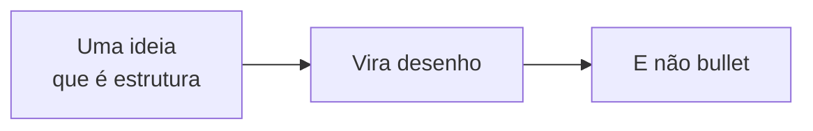

<!--
Este deck fica FORA de aulas/, então o build do site nunca o publica. Ele existe
para responder "como isto fica na tela?" sem precisar abrir uma aula de verdade.
Ao criar um layout ou componente novo, acrescente o slide dele aqui.
-->

---
layout: agenda
kicker: O que tem aqui
title: O catálogo
items:
  - { topic: "Aberturas e fechos", desc: "lead, section, statement, quote, pausa, end" }
  - { topic: "Layouts de conteúdo", desc: "default, define, agenda, steps, panels, columns, vs, timeline, metric, diagram" }
  - { topic: "Componentes", desc: "Callout, Tabela, Circular, Momento, Cronometro, Icon" }
  - { topic: "As regras", desc: "o que o tema faz por você e o que não fazer" }
---

---
layout: section
index: "01"
kicker: Parte um
title: Aberturas e fechos
subtitle: Os slides invertidos — tinta no lugar do papel — que marcam o ritmo da aula
---

---
layout: statement
kicker: "layout: statement"
title: Uma frase só, do tamanho da sala — para a ideia que deve sobrar da aula.
---

<!-- Campos: kicker, title. O corpo é opcional e entra menor, sob a frase. -->

---
layout: quote
quote: "Se você não conseguir reproduzir minhas descobertas… é porque sua introspecção não foi bem treinada."
author: J. B. Watson, 1913, p. 163
---

<!-- Campos: quote (obrigatório), author. Fonte primária lida em voz alta rende mais que paráfrase. -->

---
layout: pausa
kicker: "layout: pausa"
title: Intervalo
tempo: 15 min
note: O relógio é de verdade — clique nele para iniciar a contagem regressiva.
---

Campos: `kicker`, `title`, `tempo`, `note`. O corpo é opcional.

---
layout: section
index: "02"
kicker: Parte dois
title: Layouts de conteúdo
subtitle: A escolha do layout é a decisão de design da aula — o resto o tema desenha
---

---
layout: default
kicker: "layout: default"
title: O layout de uso geral
---

O corpo é markdown livre: parágrafos, listas e os componentes do tema.

- Um bullet é uma frase curta, não um período inteiro
- Até seis por slide; passou disso, o slide é outro
- `<v-clicks>` em volta da lista revela item a item

<Callout icon="lucide:info">
Texto solto e texto de componente têm o <strong>mesmo tamanho</strong> — nada de segundo nível ilegível no fundo da sala.
</Callout>

---
layout: define
kicker: "layout: define"
term: Termo em destaque
definition: A definição fica no cartão, com o marca-texto no que importa.
points:
  - "Os `points` são os desdobramentos, e entram em cascata"
  - "É o layout que mais aparece numa aula de teoria"
  - "O corpo do slide é opcional e cabe embaixo"
---

<Callout tom="alerta" icon="lucide:triangle-alert">
Campos: <strong>term</strong> (obrigatório), definition, points, kicker.
</Callout>

---
layout: steps
kicker: "layout: steps"
title: Um processo, na ordem
steps:
  - { title: Primeiro, desc: "a linha tracejada é riscada da esquerda para a direita", icon: "lucide:cloud" }
  - { title: Segundo, desc: "cada passo entra depois do anterior", icon: "lucide:telescope" }
  - { title: Terceiro, desc: "o ícone é opcional; sem ele, entra o número", icon: "lucide:ruler" }
  - { title: Quarto, desc: "três a cinco passos; mais que isso não se lê", icon: "lucide:git-branch" }
---

---
layout: panels
kicker: "layout: panels"
title: Dois ou três subtemas em cartões
panels:
  - icon: "lucide:ruler"
    title: Um painel
    items:
      - "Cada painel tem ícone, título e itens"
      - "Bom para dois lados de uma mesma questão"
  - icon: "lucide:dna"
    title: Outro painel
    items:
      - "Três painéis ainda cabem; quatro não"
      - "O corpo do slide é opcional e fecha embaixo"
---

<Callout icon="lucide:lightbulb">
Use <code>panels</code> quando os blocos são <strong>paralelos</strong>; use <code>vs</code> quando são <strong>opostos</strong>.
</Callout>

---
layout: columns
kicker: "layout: columns"
title: Listas paralelas
columns:
  - title: "Coluna um"
    items:
      - "Sem a carga de oposição do `vs`"
      - "Duas ou três colunas"
  - title: "Coluna dois"
    items:
      - "Cada coluna tem título e itens"
      - "O filete sob o título é riscado na entrada"
  - title: "Coluna três"
    items:
      - "Boa para uma síntese de três pontos"
      - "O corpo é opcional"
---

---
layout: vs
kicker: "layout: vs"
title: A oposição frente a frente
label: ×
left:
  title: Um lado
  items:
    - "Entra pela esquerda"
    - "Fica em tinta neutra"
    - "É o lado que se abandona"
right:
  title: O outro
  items:
    - "Entra depois, pela direita"
    - "Fica no acento"
    - "É o lado que se defende"
---

---
layout: timeline
kicker: "layout: timeline"
title: Uma sequência datada
events:
  - { date: "1860s", title: "Fechner", desc: "a linha é desenhada e os marcos pipocam na ordem" }
  - { date: "1868", title: "Donders", desc: "três a cinco eventos cabem bem" }
  - { date: "1885", title: "Ebbinghaus", desc: "data, título e uma descrição curta" }
  - { date: "1900s", title: "Pavlov", desc: "a cronologia acontecendo na tela" }
---

---
layout: metric
kicker: "layout: metric"
value: "1940"
unit: ""
label: O número <em>conta</em> até o valor ao entrar no slide. Valor não numérico (como <strong>?</strong>) é impresso como está.
ghost: "?"
---

---
layout: diagram
kicker: "layout: diagram"
title: O palco do desenho
note: O Mermaid é recolorido com os tokens do tema e esticado até a largura do palco — nada de diagrama em corpo 8 no projetor.
---

---
layout: section
index: "03"
kicker: Parte três
title: Componentes
subtitle: O que se compõe dentro do corpo de um slide `default`, `define`, `panels` ou `columns`
---

---
layout: default
kicker: Componente
title: <code>Callout</code> — o aparte do slide
---

<Callout icon="lucide:info">
<strong>nota</strong> (padrão) — o comentário de margem, em azul caneta.
</Callout>

<Callout tom="alerta" icon="lucide:triangle-alert">
<strong>alerta</strong> — o erro que a turma costuma cometer.
</Callout>

<Callout tom="bom" icon="lucide:check">
<strong>bom</strong> — o que se sustenta.
</Callout>

<Callout tom="ruim" icon="lucide:circle-x">
<strong>ruim</strong> — o que não se sustenta.
</Callout>

---
layout: default
kicker: Componente
title: <code>Tabela</code> — com realce e entrada em cascata
---

<Tabela
  :dados="[
    ['Campo', 'O que faz'],
    ['dados', 'matriz de linhas; a primeira é o cabeçalho se houver <code>cabecalho</code>'],
    ['cabecalho', 'trata a primeira linha como cabeçalho'],
    ['realce', '<code>linha:N</code> ou <code>coluna:N</code>, contando a partir de 1'],
    ['compacta', 'menos respiro — para tabelas de cinco colunas'],
  ]"
  cabecalho
  realce="linha:4"
/>

---
layout: default
kicker: Componente
title: <code>Circular</code> — a explicação que volta ao início
---

<Circular
  observacao="Come vegetais"
  ficcao="Acredita no vegetarianismo"
  inferencia="inferimos que…"
  explicacao="…e come por isso"
  nota="O tracejado corre sem parar: a explicação volta ao ponto de partida, que é o próprio argumento."
/>

---
layout: default
kicker: Componentes
title: <code>Momento</code> e <code>Cronometro</code>
---

<Momento tipo="atividade" tempo="12 min" titulo="O bloco de atividade">

Quatro tipos: `atividade`, `discussao`, `pausa` e `sintese` — cada um com sua cor, seu ícone e seu rótulo. A etiqueta de tempo é um cronômetro: **clique para iniciar**.

</Momento>

<Momento tipo="sintese" tempo="8 min" titulo="O bloco de fechamento" />

---
layout: section
index: "04"
kicker: Parte quatro
title: As regras
subtitle: O pouco que o autor precisa saber para o tema fazer o resto
---

---
layout: panels
kicker: Contrato
title: O que o tema faz por você
panels:
  - icon: "lucide:type"
    title: Faz
    items:
      - "Tamanho de texto pensado para projeção"
      - "Entrada em cascata, sem você anotar nada"
      - "Trilha das partes e rodapé com a página"
      - "Encolhe o slide que não couber — e avisa no console"
  - icon: "lucide:ban"
    title: Não faça
    items:
      - "CSS, `<style>` ou HTML de layout dentro do `.md`"
      - "Compartilhar um `---` entre dois frontmatters"
      - "Repetir `title:` no bloco de abertura"
      - "Mais de seis bullets num slide"
---

<Callout icon="lucide:terminal">
<code>npm run lint</code> valida os decks contra <code>tema/layouts.json</code>: layout que não existe, campo obrigatório faltando e slide vazio são <strong>erro</strong>; campo com nome errado e slide denso são <strong>aviso</strong>.
</Callout>

---
layout: default
kicker: Texto
title: O que dá para marcar no meio de uma frase
---

- `<em>` num título vira **itálico no acento**: veja o título do próximo slide
- `` passa o **marca-texto amarelo** por baixo da palavra
- `**negrito**` e `*itálico*` funcionam normalmente no corpo
- Campos de frontmatter aceitam HTML — `<strong>`, `<em>`, `<code>`

<Callout tom="bom" icon="lucide:check">
Fora isso, <strong>não escreva HTML</strong>. Se está precisando de uma <em>div</em>, o layout escolhido é o errado.
</Callout>

---
layout: statement
kicker: A régua
title: Se do fundo da sala não se lê, <em>não está no slide</em>.
---

---
layout: end
title: Fim do catálogo
subtitle: "O contrato completo está em docs/tema.md; o código, em tema/"
contact: "npm run ref abre este deck · npm run dev abre a primeira aula"
---
